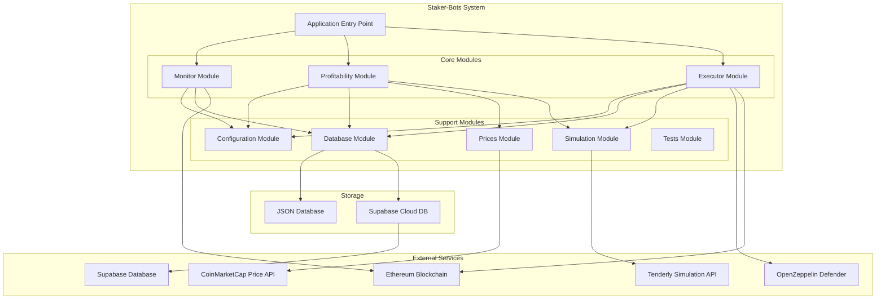
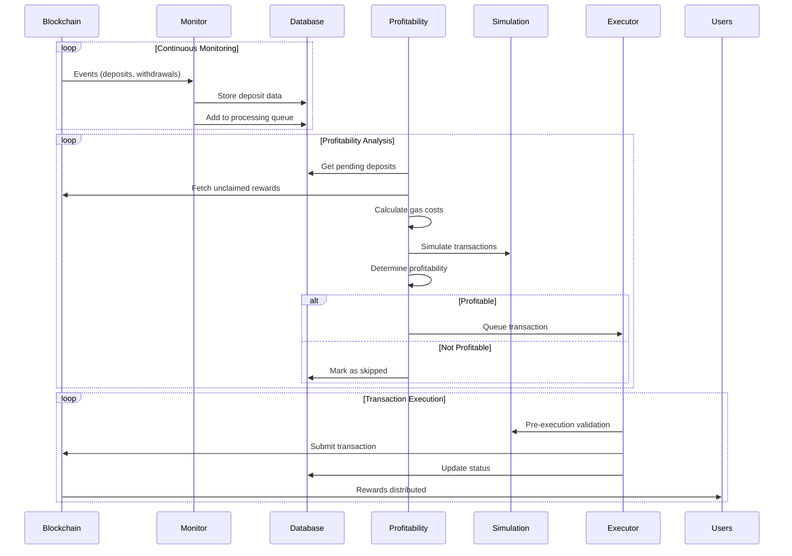
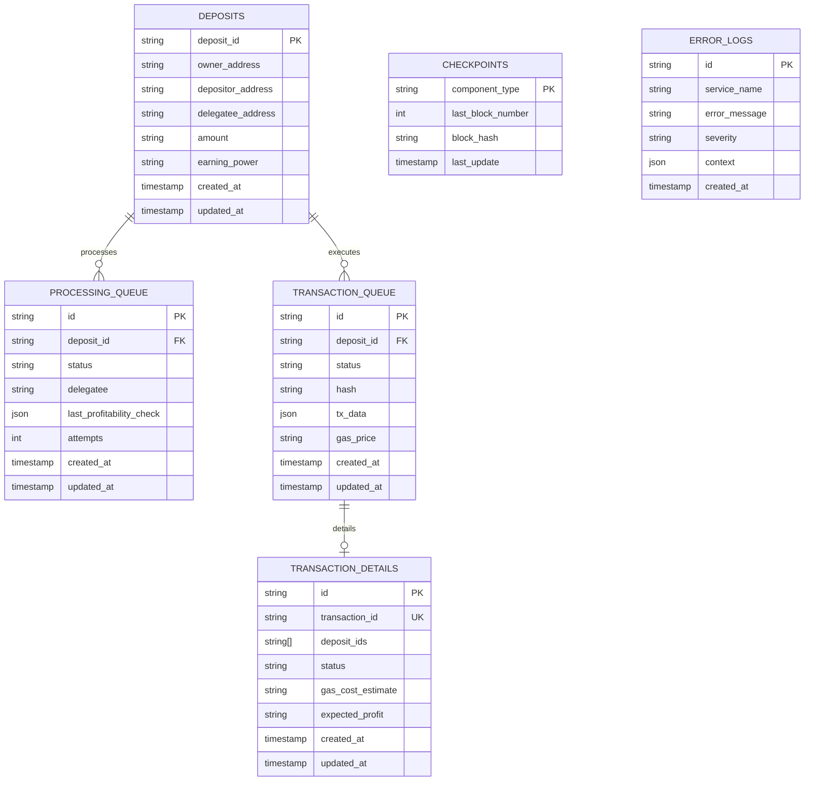
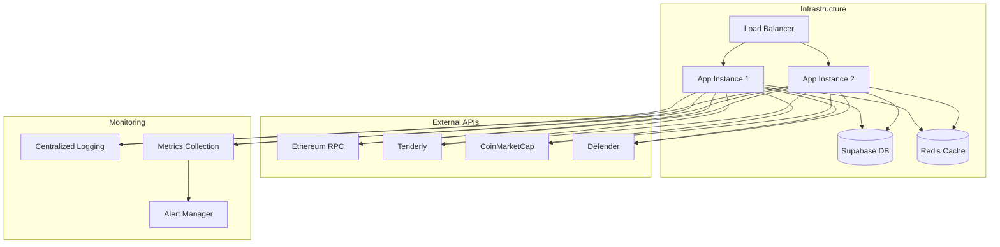

# Staker-Bots System Architecture

## Overview

The Staker-Bots system is an automated reward claiming service for liquid staking protocols. It monitors blockchain events, analyzes profitability, and executes reward claims on behalf of users while ensuring economic viability. The system employs a modular architecture with independent components that work together to provide a reliable and profitable service.

## High-Level Architecture



## System Flow



## Module Breakdown

### 1. Monitor Module

**Purpose**: Continuously watches blockchain for staking-related events.

**Key Features**:

- Event polling with checkpoint management
- Deposit lifecycle tracking
- Delegation change monitoring
- Reorg-safe block processing

**Data Flow**:

```
Blockchain Events → Event Processing → Database Storage → Processing Queue
```

### 2. Profitability Module

**Purpose**: Analyzes deposits to determine profitable reward claiming opportunities.

**Key Features**:

- Two-stage gas estimation
- Batch optimization
- Price-aware calculations
- Margin scaling

**Algorithm**:

```
1. Fetch unclaimed rewards
2. Calculate gas costs in reward tokens
3. Apply profit margins
4. Run simulations for accuracy
5. Create profitable batches
```

### 3. Executor Module

**Purpose**: Submits and monitors reward claim transactions.

**Key Features**:

- Multiple execution strategies (Wallet, Defender)
- Transaction queue management
- Gas optimization
- Retry logic

**Execution Flow**:

```
Validation → Simulation → Submission → Monitoring → Confirmation
```

### 4. Configuration Module

**Purpose**: Centralized configuration management with environment-based settings.

**Components**:

- Environment variable loading
- Type-safe configuration objects
- Contract ABIs
- System constants

### 5. Database Module

**Purpose**: Flexible data persistence with multiple backend support.

**Features**:

- Supabase and JSON storage
- Automatic fallback
- Transaction support
- Migration system

### 6. Prices Module

**Purpose**: Real-time price feeds for gas cost calculations.

**Components**:

- CoinMarketCap integration
- Price caching
- Currency conversion
- Fallback mechanisms

### 7. Simulation Module

**Purpose**: Transaction simulation using Tenderly for accurate gas estimation.

**Features**:

- Pre-execution validation
- Gas estimation
- Error detection
- Bundle simulation

### 8. Tests Module

**Purpose**: Comprehensive testing suite for system validation.

**Coverage**:

- Unit tests for components
- Integration tests for workflows
- Mock providers and contracts
- Test utilities

## Data Model



## Technology Stack

### Core Technologies

- **Runtime**: Node.js with TypeScript
- **Blockchain**: Ethers.js v6
- **Database**: Supabase (PostgreSQL) with JSON fallback
- **Testing**: Jest with integration test support
- **Simulation**: Tenderly API
- **Price Feeds**: CoinMarketCap API

### External Services

- **Blockchain RPC**: Ethereum mainnet/testnet
- **Gas Simulation**: Tenderly
- **Price Oracle**: CoinMarketCap
- **Transaction Relay**: OpenZeppelin Defender (optional)
- **Database**: Supabase Cloud

### Development Tools

- **Type Safety**: Full TypeScript coverage
- **Code Quality**: ESLint, Prettier
- **Testing**: Unit and integration tests
- **Documentation**: Comprehensive module docs

## Deployment Architecture

### Production Deployment



### Component Distribution

Different deployment configurations are supported:

1. **Monolithic**: All components in single process
2. **Distributed**: Components in separate processes/containers
3. **Specialized**: Different instances for different roles

```bash
# Monitor-only instance
COMPONENTS=monitor npm start

# Execution-only instance
COMPONENTS=executor,profitability npm start

# Full-service instance
COMPONENTS=all npm start
```

## Security Considerations

### Private Key Management

- Environment variable storage
- Support for hardware security modules
- Rotation capabilities

### API Security

- Rate limiting for external APIs
- Error handling for API failures
- Credential rotation

### Transaction Security

- Pre-execution simulation
- Gas limit enforcement
- Slippage protection

### Operational Security

- Error logging without sensitive data
- Secure database connections
- Network isolation

## Performance Characteristics

### Throughput

- **Event Processing**: 1000+ events/minute
- **Profitability Checks**: 100+ deposits/minute
- **Transaction Execution**: 10+ tx/minute (limited by gas)

### Latency

- **Event Detection**: < 30 seconds
- **Profitability Analysis**: < 10 seconds
- **Transaction Submission**: < 5 seconds

### Resource Usage

- **Memory**: 256MB - 1GB depending on queue size
- **CPU**: Low, event-driven architecture
- **Network**: Moderate, API calls for prices and simulation
- **Storage**: Minimal, mostly metadata

## Monitoring and Observability

### Health Checks

- Component status monitoring
- Database connectivity
- External API availability
- Blockchain sync status

### Metrics

- Transaction success rates
- Profitability accuracy
- Processing latency
- Error rates by component

### Alerting

- Failed transactions
- Component failures
- API rate limits
- Balance thresholds

### Logging

- Structured JSON logging
- Component-specific log levels
- Error context preservation
- Performance metrics

## Scalability and Reliability

### Horizontal Scaling

- Stateless component design
- Database-backed coordination
- Load balancing support

### Fault Tolerance

- Graceful error handling
- Automatic retry mechanisms
- Fallback strategies
- Circuit breakers

### Data Consistency

- Checkpoint-based processing
- Atomic transactions
- Idempotent operations
- Reorg handling

### Recovery Mechanisms

- Automatic restart on failures
- State restoration from checkpoints
- Queue replay capabilities
- Manual intervention tools

This architecture provides a robust, scalable, and maintainable system for automated staking reward management while ensuring economic viability and user safety.
