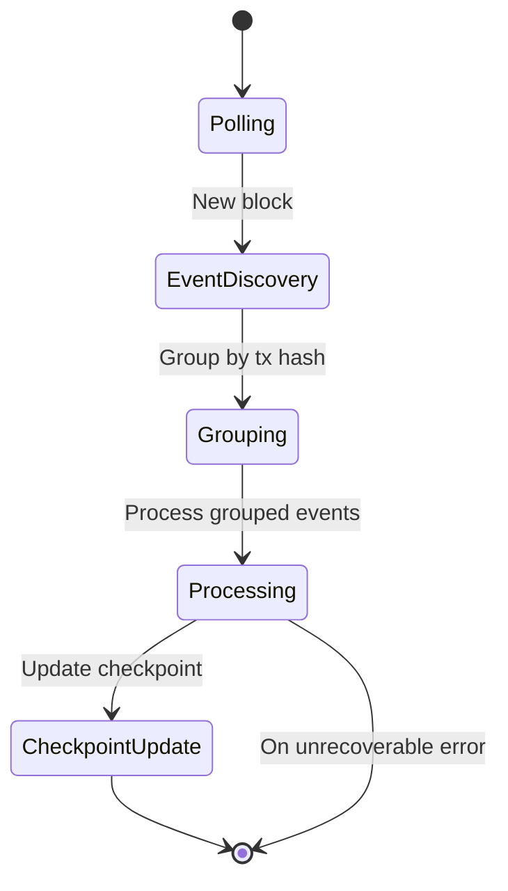
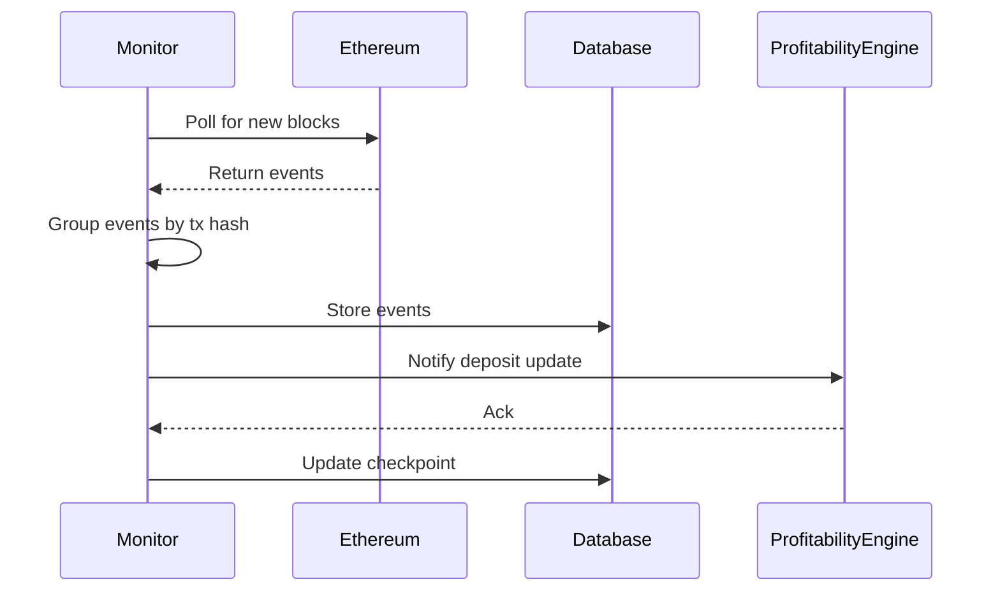

# Staker Monitor

A robust monitoring system for tracking staking events on the blockchain. This system monitors stake deposits, withdrawals, and delegatee changes in real-time while maintaining data consistency and handling network interruptions gracefully.

---

## State Diagram



---

## Sequence Diagram: Event Processing



---

## Overview

The Staker Monitor is designed to:

- Track staking events from a specified smart contract
- Process and store events in a database (Supabase or JSON)
- Handle network reorgs and connection issues
- Group related events by transaction for atomic processing
- Provide real-time monitoring status and health checks
- Support graceful shutdowns and error recovery

## Architecture

### Core Components

1. **StakerMonitor**: The main orchestrator that:

   - Manages the event processing lifecycle
   - Handles blockchain polling and event filtering
   - Maintains processing checkpoints
   - Groups related events by transaction
   - Provides monitoring status and health checks

2. **EventProcessor**: Processes blockchain events:

   - StakeDeposited
   - StakeWithdrawn
   - DelegateeAltered

3. **Database Interface**: Supports multiple database backends:
   - Supabase (default)
   - JSON file storage

---

## Key Features

- **Transaction Grouping**: Groups related events by transaction hash for atomic processing
- **Checkpoint System**: Tracks last processed block to resume after interruptions
- **Retry Logic**: Implements exponential backoff for failed event processing
- **Health Monitoring**: Regular status checks and lag reporting
- **Graceful Shutdown**: Proper cleanup on process termination
- **Atomic Processing**: Ensures related events are processed together
- **Configurable Confirmations**: Waits for specified block confirmations before processing

---

## Configuration

Configuration is managed through environment variables:

```
RPC_URL= # Blockchain RPC endpoint
STAKER_CONTRACT_ADDRESS= # Address of the staker contract
SUPABASE_URL= # Supabase project URL
SUPABASE_KEY= # Supabase API key
CHAIN_ID=42161 # Chain ID (default: Arbitrum One)
START_BLOCK=0 # Starting block number
LOG_LEVEL=info # Logging level (debug|info|warn|error)
DATABASE_TYPE=supabase # Database type (supabase|json)
POLL_INTERVAL=15 # Polling interval in seconds
MAX_BLOCK_RANGE=2000 # Maximum blocks to process in one batch
MAX_RETRIES=5 # Maximum retry attempts for failed events
REORG_DEPTH=64 # Number of blocks to check for reorgs
CONFIRMATIONS=20 # Required block confirmations
HEALTH_CHECK_INTERVAL=60 # Health check interval in seconds
```

---

## Error Handling

- Consistent error types with context
- Automatic retries with exponential backoff
- Transaction-level atomicity
- Graceful shutdown on SIGTERM/SIGINT
- Network disconnection recovery
- Database operation retries

---

## Monitoring and Maintenance

- Real-time status: processing lag, last processed block, network status
- Health checks: network, lag, database, contract, event status
- Use `getMonitorStatus()` for programmatic health checks

---

## Usage

1. Set up environment variables
2. Initialize database (if using Supabase, run migrations)
3. Start the monitor:

```typescript
import { ethers } from "ethers";
import { StakerMonitor } from "./StakerMonitor";
import { createMonitorConfig } from "./constants";
import { DatabaseWrapper } from "../database";

async function main() {
  // Initialize provider
  const provider = new ethers.JsonRpcProvider(process.env.RPC_URL);

  // Initialize database
  const db = new DatabaseWrapper({
    type: process.env.DATABASE_TYPE || "supabase",
    // Additional DB config
  });

  // Create monitor config
  const config = createMonitorConfig(provider, db);

  // Initialize and start monitor
  const monitor = new StakerMonitor(config);
  await monitor.start();

  // Graceful shutdown
  process.on("SIGINT", async () => {
    await monitor.stop();
    process.exit(0);
  });
}

main().catch(console.error);
```
