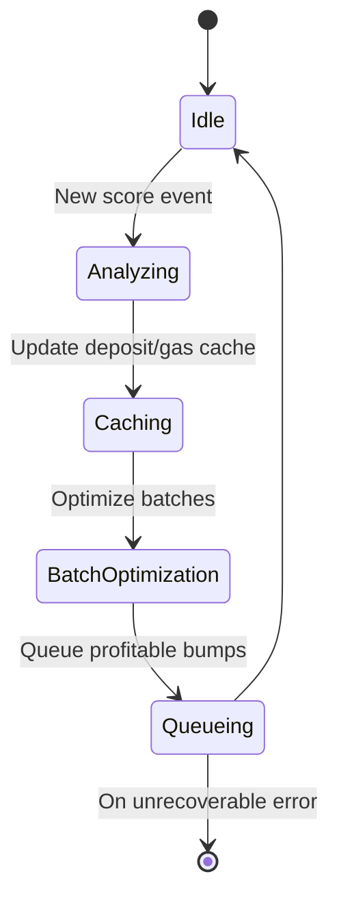
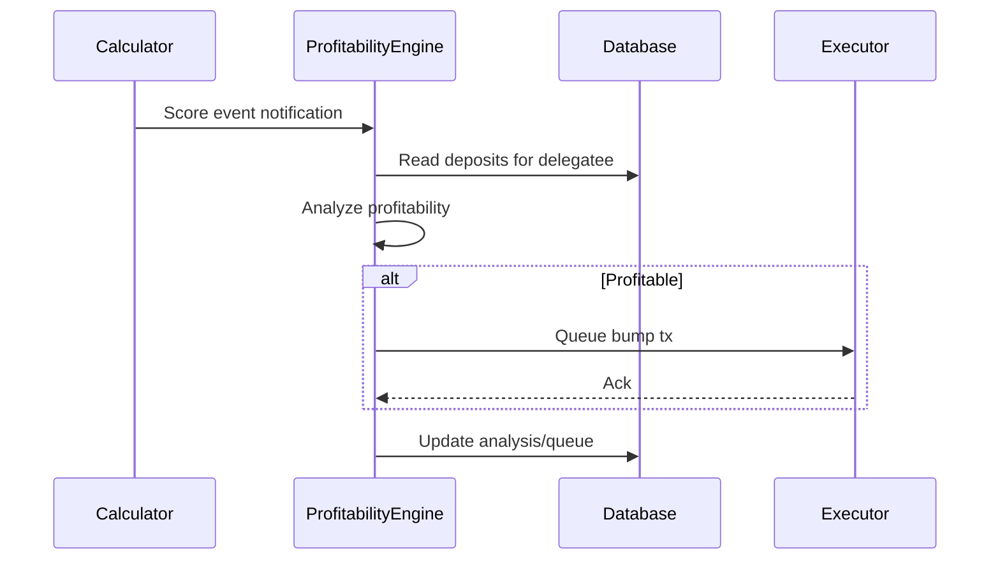
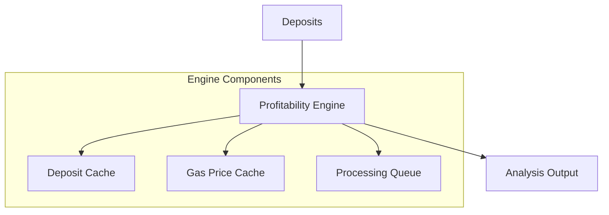

# Arbitrum Profitability Engine

The Profitability Engine analyzes Staker deposits to determine optimal profitability metrics for bumping. It provides detailed analysis of deposits, considering gas costs, reward rates, and market conditions.

---

## State Diagram



---

## Sequence Diagram: Batch Profitability Analysis



---

## Overview

The profitability engine integrates with the [Staker Contract](https://github.com/withtally/staker/blob/main/src/Staker.sol) to determine initial bump eligibility and calculates optimal tips and batch sizes for profitable bump operations.

## Architecture

### Queue-Based Processing System

The profitability engine implements a queue-based system that responds to score events from the calculator component:

1. **Score Event Handling**: When delegatee scores change, the calculator notifies the profitability engine
2. **Deposit Queueing**: All deposits associated with the updated delegatee are added to a processing queue
3. **Batch Processing**: Deposits are processed in batches to optimize gas usage
4. **Transaction Execution**: Profitable deposits are forwarded to the executor component

This event-driven architecture ensures that deposits are only processed when they might have become profitable due to score changes, rather than checking all deposits periodically.

### System Architecture



### Key Components

#### ProfitabilityEngineWrapper

- Main entry point for profitability analysis functionality
- Manages the processing and transaction queues
- Responds to score events from calculator component
- Coordinates with executor for transaction submission
- Implements strategy pattern to support different profitability calculation methods
- Tracks engine state, queue sizes, and processing statistics

#### BaseProfitabilityEngine

- Default profitability engine implementation
- Validates bump requirements using calculator
- Calculates optimal tips based on gas costs
- Performs batch analysis and optimization
- Implements gas price buffering for volatility

## Database Integration

The queue-based system persists queue state in the database for resilience:

- **Processing Queue**: Tracks deposits that need profitability checks
- **Transaction Queue**: Tracks deposits that have been submitted for execution

Each queue item maintains:

- Current status (pending, processing, completed, failed)
- Attempt count for retry logic
- Error information for troubleshooting
- Timestamps for monitoring

## Inputs & Outputs

### Inputs

#### Configuration (ProfitabilityConfig)

```typescript
{
  rewardTokenAddress: string,     // Reward token contract address
  minProfitMargin: bigint,        // Minimum acceptable profit
  gasPriceBuffer: number,         // Gas price safety buffer (%)
  maxBatchSize: number,           // Maximum deposits per batch
  defaultTipReceiver: string,     // Default tip receiver address
  priceFeed: {
    cacheDuration: number         // Price cache duration (ms)
  }
}
```

#### Deposit Data

```typescript
{
  deposit_id: bigint,            // Unique deposit identifier
  owner_address: string,         // Deposit owner address
  delegatee_address: string,     // Delegatee address
  amount: bigint,                // Deposit amount
  earning_power: bigint          // Current earning power
}
```

### Outputs

#### Profitability Analysis

```typescript
{
  canBump: boolean,               // Overall profitability flag
  constraints: {
    calculatorEligible: boolean,  // Calculator eligibility check
    hasEnoughRewards: boolean,    // Reward threshold check
    isProfitable: boolean         // Profit after gas check
  },
  estimates: {
    optimalTip: bigint,           // Calculated optimal tip
    gasEstimate: bigint,          // Estimated gas cost
    expectedProfit: bigint,       // Net profit after gas
    tipReceiver: string           // Tip receiver address
  }
}
```

#### Batch Analysis

```typescript
{
  deposits: [                    // Array of analyzed deposits
    {
      depositId: bigint,         // Deposit ID
      profitability: {...}       // Profitability analysis
    }
  ],
  totalGasEstimate: bigint,      // Total gas for all deposits
  totalExpectedProfit: bigint,   // Total net profit
  recommendedBatchSize: number   // Optimal batch size
}
```

## Error Handling

- Early returns for invalid/missing data
- Retries for transient errors
- Logs and propagates context-rich errors

## Usage

### Initializing the Engine

```typescript
const engine = new ProfitabilityEngineWrapper(
  database,
  provider,
  stakerAddress,
  logger,
  {
    minProfitMargin: BigInt(1e16), // 0.01 ETH
    maxBatchSize: 10,
    gasPriceBuffer: 20, // 20% buffer
    rewardTokenAddress: rewardTokenAddress,
    defaultTipReceiver: tipReceiverAddress,
    priceFeed: {
      cacheDuration: 10 * 60 * 1000, // 10 minutes
    },
  },
);

// Set up connections between components
calculator.setProfitabilityEngine(engine);
engine.setExecutor(executor);

// Start the engine
await engine.start();
```

### Triggering Score Events

Score events are normally triggered by the calculator component when it detects changes in delegatee scores. For testing, you can trigger them manually:

```typescript
await engine.onScoreEvent(delegateeAddress, newScore);
```

### Checking Single Deposit Profitability

```typescript
const profitability = await engine.checkProfitability(deposit);
console.log("Can bump:", profitability.canBump);
console.log("Optimal tip:", profitability.estimates.optimalTip.toString());
console.log(
  "Expected profit:",
  profitability.estimates.expectedProfit.toString(),
);
```

### Analyzing Batch Profitability

```typescript
const batchAnalysis = await engine.analyzeBatchProfitability(deposits);
console.log("Recommended batch size:", batchAnalysis.recommendedBatchSize);
console.log(
  "Total expected profit:",
  batchAnalysis.totalExpectedProfit.toString(),
);
```

### Monitoring Engine Status

```typescript
const status = await engine.getStatus();
console.log("Engine running:", status.isRunning);
console.log("Queue size:", status.queueSize);
console.log("Delegatee count:", status.delegateeCount);

const queueStats = await engine.getQueueStats();
console.log("Pending items:", queueStats.pendingCount);
console.log("Processing items:", queueStats.processingCount);
console.log("Completed items:", queueStats.completedCount);
console.log("Failed items:", queueStats.failedCount);
```

## Performance Optimizations

### Caching System

- **Deposit Cache**

  - Reduces database load
  - Quick access to frequent deposits

- **Gas Price Cache**
  - Updates every minute
  - Includes price buffer
  - Reduces RPC calls

### Batch Processing

- Groups deposits by delegatee
- Optimizes gas usage
- Maintains processing queue
- Handles requeuing on restarts

## Integration Points

- BinaryEligibilityCalculator for bump eligibility checks and score event notifications
- Executor component for transaction submission
- Staker contract for reward and tip constraints
- Price feed for cost estimation
- Database for deposit information and queue persistence
