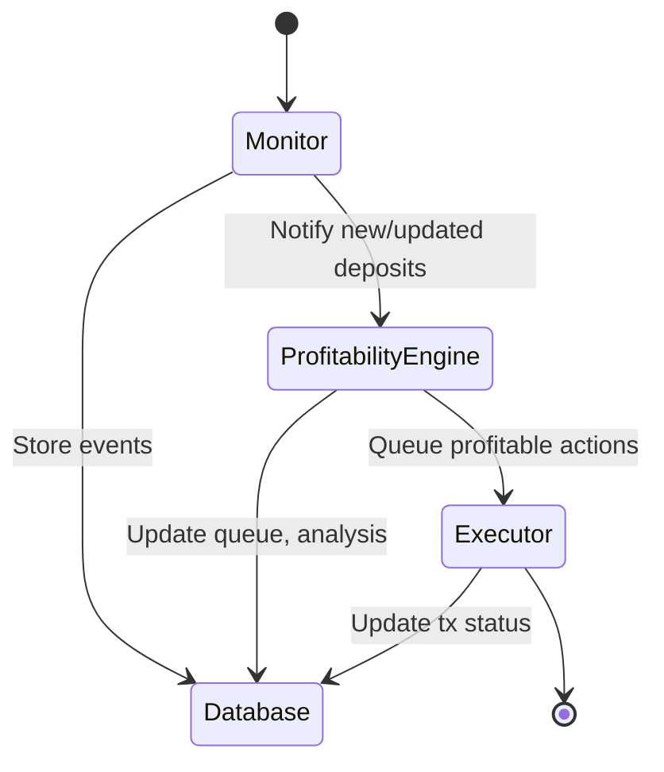
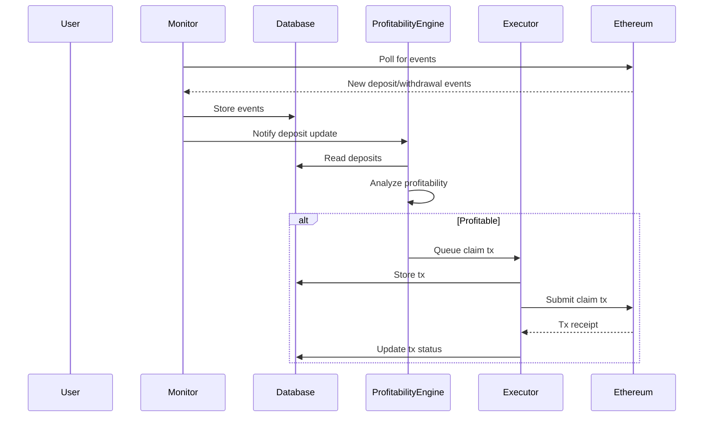
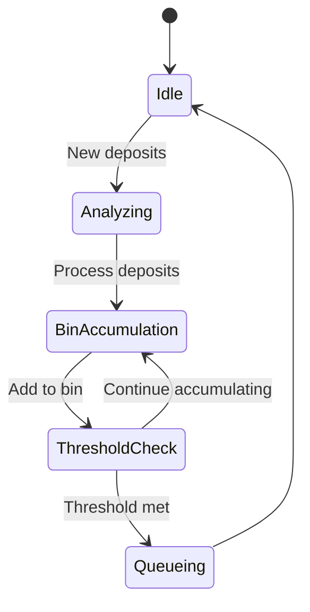

# Staker Profitability Monitor

A modular service for monitoring staking deposits, executing profitable transactions, and claiming GovLst rewards.

---

## System Overview

This system is composed of four main components:

- **Monitor**: Tracks on-chain staking events and updates the database.
- **Profitability Engine**: Analyzes deposits for profitable actions and batches.
- **Executor**: Executes profitable transactions and manages the transaction queue.
- **Database**: Persists all state, events, and queue data (supports Supabase and JSON).

---

## High-Level State Diagram



---

## Sequence Diagram: Claiming GovLst Rewards



---

## Component Architecture

### 1. Monitor

- Tracks on-chain events (deposits, withdrawals, delegatee changes)
- Groups events by transaction
- Maintains checkpoints for resilience
- Emits events to the profitability engine

### 2. Profitability Engine

- Analyzes deposits for claim profitability
- Optimizes batch size and timing
- Uses price feeds and gas estimates
- Queues profitable claims for execution

### 3. Executor

- Manages transaction queue (FIFO)
- Executes claim transactions (wallet or Defender relayer)
- Handles retries, confirmations, and tip management

### 4. Database

- Stores deposits, events, checkpoints, queues, and claim history
- Supports Supabase (production) and JSON (testing)

---

## Configuration

Configuration is managed via environment variables and `src/configuration/`.

- See `.env.example` for all options.
- Key parameters: RPC_URL, STAKER_CONTRACT_ADDRESS, LST_ADDRESS, GOVLST_ADDRESSES, EXECUTOR_TYPE, DATABASE_TYPE, etc.

---

## Running the Service

```bash
pnpm run build
pnpm run prod
```

Or run specific components:

```bash
COMPONENTS=monitor,profitability pnpm run prod
```

---

## Health Checks & Maintenance

- Each component exposes health/status logs.
- Use `pnpm run health-check` for status.
- Logs: `output.log` (info), `errors.log` (errors)

---

## Database Schema (Summary)

- `deposits`: Tracks staking deposits
- `processing_checkpoints`: Tracks component state
- `govlst_deposits`: Tracks GovLst-owned deposits
- `govlst_claim_history`: Records claim executions
- `processing_queue`: Manages analysis queue
- `transaction_queue`: Manages tx execution queue

---

## See component READMEs for detailed diagrams and flows.

## Table of Contents

- [Prerequisites](#prerequisites)
- [Installation](#installation)
- [Environment Setup](#environment-setup)
- [Component Architecture](#component-architecture)
- [Configuration Guide](#configuration-guide)
- [Running the Service](#running-the-service)
- [Monitoring and Maintenance](#monitoring-and-maintenance)
- [Troubleshooting](#troubleshooting)

## Prerequisites

Before setting up the service, ensure you have:

1. Node.js v18+ installed
2. PNPM package manager installed (`npm install -g pnpm`)
3. Access to an Ethereum RPC endpoint (e.g., Alchemy, Infura)
4. A wallet with sufficient funds for gas fees
5. (Optional) OpenZeppelin Defender account for production deployments

## Installation

1. Clone the repository:

```bash
git clone <repository-url>
cd staker-bots
```

2. Install dependencies:

```bash
pnpm install
```

3. Create environment configuration:

```bash
cp .env.example .env
```

## Environment Setup

The service requires careful configuration of environment variables. Here's a detailed guide for each section:

### 1. Basic Network Configuration

```env
# Required: RPC endpoint URL
RPC_URL=https://eth-mainnet.g.alchemy.com/v2/your-api-key

# Required: Chain ID (1 for mainnet, 11155111 for sepolia)
CHAIN_ID=1

# Required: Network name
NETWORK_NAME=mainnet

# Optional: Starting block number (defaults to latest if not set)
START_BLOCK=0
```

### 2. Contract Configuration

```env
# Required: Staker contract address
STAKER_CONTRACT_ADDRESS=0x...

# Required: LST token contract address
LST_ADDRESS=0x...

# Required: GovLst contract addresses (comma-separated)
GOVLST_ADDRESSES=0x...,0x...

# Optional: Default delegatee address
DEFAULT_DELEGATEE=0x...

# Optional: Tip receiver address
TIP_RECEIVER=0x...
```

### 3. Executor Configuration

Choose ONE of these execution methods:

#### A. Local Wallet Executor

```env
EXECUTOR_TYPE=wallet
EXECUTOR_PRIVATE_KEY=your_private_key_without_0x
```

#### B. Defender Relayer

```env
EXECUTOR_TYPE=defender
DEFENDER_API_KEY=your_defender_api_key
DEFENDER_SECRET_KEY=your_defender_secret_key
PUBLIC_ADDRESS_DEFENDER=0x...
```

### 4. Database Configuration

Choose ONE storage option:

#### A. JSON Storage (Default, recommended for testing)

```env
DATABASE_TYPE=json
```

#### B. Supabase (Recommended for production)

```env
DATABASE_TYPE=supabase
SUPABASE_URL=your_supabase_url
SUPABASE_KEY=your_supabase_key
```

### 5. Component Selection

```env
# Choose which components to run (all by default)
COMPONENTS=monitor,profitability,executor
```

### 6. Performance Tuning

```env
# Polling and Intervals
POLL_INTERVAL=15
HEALTH_CHECK_INTERVAL=60
GOVLST_CLAIM_INTERVAL=1800

# Block Processing
MAX_BLOCK_RANGE=2000
CONFIRMATIONS=20
REORG_DEPTH=64

# Transaction Management
GOVLST_MAX_BATCH_SIZE=5
GOVLST_GAS_PRICE_BUFFER=30
GOVLST_MIN_PROFIT_MARGIN_PERCENT=10
```

## Component Architecture

The service consists of four main components that can be run independently or together:

### 1. Monitor Component

- **Purpose**: Tracks on-chain events related to staking activities
- **Key Features**:
  - Polls blockchain for new events
  - Processes stake deposits/withdrawals
  - Maintains processing checkpoints
  - Handles network reorgs
- **Configuration Focus**:
  - `POLL_INTERVAL`: How often to check for new blocks
  - `MAX_BLOCK_RANGE`: Maximum blocks to process at once
  - `CONFIRMATIONS`: Required block confirmations

### 2. Profitability Engine

- **Purpose**: Analyzes deposits for profitable actions
- **Key Features**:
  - Calculates potential rewards
  - Estimates gas costs
  - Determines profitability
  - Queues profitable transactions
- **Configuration Focus**:
  - `GOVLST_MIN_PROFIT_MARGIN_PERCENT`: Minimum profit threshold
  - `GOVLST_GAS_PRICE_BUFFER`: Gas price safety margin
  - `PROFITABILITY_CHECK_INTERVAL`: Analysis frequency

### 3. Executor Component

- **Purpose**: Executes on-chain transactions
- **Key Features**:
  - Manages transaction queue
  - Handles gas optimization
  - Supports multiple execution strategies
  - Implements retry logic
- **Configuration Focus**:
  - `EXECUTOR_TYPE`: Wallet or Defender
  - `EXECUTOR_MIN_BALANCE`: Minimum balance threshold
  - `EXECUTOR_MAX_PENDING_TXS`: Concurrent transaction limit

### 4. GovLst Component

- **Purpose**: Manages GovLst reward claiming
- **Key Features**:
  - Monitors unclaimed rewards
  - Batches claim transactions
  - Optimizes claim timing
  - Tracks claim history
- **Configuration Focus**:
  - `GOVLST_ADDRESSES`: Contract addresses to monitor
  - `GOVLST_CLAIM_INTERVAL`: Check frequency
  - `GOVLST_MAX_BATCH_SIZE`: Maximum claims per transaction

## Running the Service

1. Build the TypeScript code:

```bash
pnpm run build
```

2. Start all components:

```bash
pnpm run prod
```

Or run specific components:

```bash
# Set COMPONENTS in .env first
COMPONENTS=monitor,profitability pnpm run prod
```

## Monitoring and Maintenance

### Health Checks

The service implements automatic health checks for each component:

```typescript
// Health check output format
{
  monitor: {
    isRunning: boolean,
    lastBlock: number,
    processingLag: number
  },
  profitability: {
    isRunning: boolean,
    queueSize: number,
    lastCheck: string
  },
  executor: {
    isRunning: boolean,
    pendingTx: number,
    balance: string
  }
}
```

### Logging

- All activities are logged to `output.log`
- Errors are logged to `errors.log`
- Log level can be configured via `LOG_LEVEL`

### Database Maintenance

For Supabase users:

1. Regular pruning is automatic
2. Manual cleanup can be triggered:

```bash
pnpm run db:cleanup
```

## Troubleshooting

### Common Issues

1. **RPC Connection Issues**

```bash
# Check RPC connection
curl -X POST -H "Content-Type: application/json" --data '{"jsonrpc":"2.0","method":"eth_blockNumber","params":[],"id":1}' $RPC_URL
```

2. **Insufficient Balance**

```bash
# Check executor balance
pnpm run check-balance
```

3. **Transaction Failures**

- Check gas price settings
- Verify contract allowances
- Review profitability thresholds

### Debug Mode

Enable detailed logging:

```env
LOG_LEVEL=debug
```

### Support and Resources

- Report issues on GitHub
- Check logs in `errors.log`
- Review transaction history in database

## Configuration Guide

### Tenderly Transaction Simulation

The system supports transaction simulation using Tenderly's API before sending transactions to the blockchain. This helps prevent wasted gas on transactions that would fail and provides more accurate gas estimates.

```env
# Tenderly Configuration
TENDERLY_USE_SIMULATE=true
TENDERLY_ACCESS_KEY=your_tenderly_access_key
TENDERLY_ACCOUNT_NAME=your_tenderly_account_name
TENDERLY_PROJECT_NAME=your_tenderly_project_name
TENDERLY_NETWORK_ID=1  # Default is 1 for mainnet, use appropriate ID for other networks
```

Benefits of transaction simulation:

- Prevents failed transactions by simulating them before sending
- Provides more accurate gas estimates for profitability calculations
- Offers detailed transaction execution traces for debugging
- Falls back gracefully to standard estimation if simulation is unavailable

### Detailed Configuration Examples

#### 1. Development Environment (Local Testing)

```env
# Network
RPC_URL=https://ethereum-sepolia-rpc.publicnode.com
CHAIN_ID=11155111
NETWORK_NAME=sepolia

# Contracts
STAKER_CONTRACT_ADDRESS=0x8C97699cBEAB273e4b469E863721522c04349057
LST_ADDRESS=0xDfdEB974D0A564d7C25610e568c1D309220236BB
GOVLST_ADDRESSES=

# Executor (Local Wallet)
EXECUTOR_TYPE=wallet
EXECUTOR_PRIVATE_KEY=your_private_key_here
TIP_RECEIVER=0x...

# Database
DATABASE_TYPE=json

# Components
COMPONENTS=monitor,profitability,executor,govlst

# Performance (Development Settings)
POLL_INTERVAL=15
MAX_BLOCK_RANGE=500
CONFIRMATIONS=1
GOVLST_MAX_BATCH_SIZE=2
GOVLST_MIN_PROFIT_MARGIN_PERCENT=5
LOG_LEVEL=debug
```

#### 2. Production Environment

```env
# Network
RPC_URL=https://eth-mainnet.g.alchemy.com/v2/your-api-key
CHAIN_ID=1
NETWORK_NAME=mainnet

# Contracts
STAKER_CONTRACT_ADDRESS=0x...
LST_ADDRESS=0x...
GOVLST_ADDRESSES=0x...,0x...

# Executor (Defender)
EXECUTOR_TYPE=defender
DEFENDER_API_KEY=your_api_key
DEFENDER_SECRET_KEY=your_secret_key
PUBLIC_ADDRESS_DEFENDER=0x...
TIP_RECEIVER=0x...

# Database
DATABASE_TYPE=supabase
SUPABASE_URL=your_url
SUPABASE_KEY=your_key

# Components
COMPONENTS=monitor,profitability,executor,govlst

# Performance (Production Settings)
POLL_INTERVAL=13
MAX_BLOCK_RANGE=2000
CONFIRMATIONS=20
REORG_DEPTH=64
GOVLST_MAX_BATCH_SIZE=5
GOVLST_MIN_PROFIT_MARGIN_PERCENT=10
GOVLST_GAS_PRICE_BUFFER=30
LOG_LEVEL=info
```

### Advanced Configuration

#### 1. Gas Optimization

Fine-tune gas settings for better transaction efficiency:

```env
# Gas Price Management
GOVLST_GAS_PRICE_BUFFER=30
DEFENDER_MAX_FEE=100000000000
DEFENDER_PRIORITY_FEE=2000000000

# Batch Processing
GOVLST_MAX_BATCH_SIZE=5
EXECUTOR_MAX_PENDING_TXS=10
```

#### 2. Health Monitoring

Configure health checks and monitoring:

```env
# Health Check Settings
HEALTH_CHECK_INTERVAL=60
CIRCUIT_BREAKER_MAX_FAILED_TXS=3
CIRCUIT_BREAKER_COOLDOWN_PERIOD=1800
CIRCUIT_BREAKER_MIN_SUCCESS_RATE=0.8

# Monitoring Thresholds
EXECUTOR_MIN_BALANCE=0.1
DEFENDER_MIN_BALANCE=0.01
```

#### 3. Database Optimization

Optimize database performance:

```env
# Database Performance
DATABASE_BATCH_TIMEOUT=3600
DATABASE_MAX_QUEUE_SIZE=1000
DATABASE_PRUNE_INTERVAL=86400
DATABASE_MAX_ARCHIVE_AGE=604800
```

### Component-Specific Configuration

#### 1. Monitor Component

```env
# Block Processing
START_BLOCK=0
MAX_BLOCK_RANGE=2000
CONFIRMATIONS=20
REORG_DEPTH=64

# Polling
POLL_INTERVAL=13
MONITOR_HEALTH_CHECK_INTERVAL=60
```

#### 2. Profitability Engine

```env
# Profitability Thresholds
GOVLST_MIN_PROFIT_MARGIN_PERCENT=10
PROFITABILITY_CHECK_INTERVAL=300
PROFITABILITY_MAX_BATCH_SIZE=50

# Price Feed
COINMARKETCAP_API_KEY=your_api_key
```

#### 3. Executor Component

```env
# Wallet Configuration
EXECUTOR_MIN_BALANCE=0.1
EXECUTOR_MAX_PENDING_TXS=10
EXECUTOR_GAS_LIMIT_BUFFER=1.3

# Transaction Management
EXECUTOR_QUEUE_POLL_INTERVAL=60
EXECUTOR_RETRY_DELAY=60
EXECUTOR_MAX_RETRIES=3
```

#### 4. GovLst Component

```env
# Reward Claiming
GOVLST_CLAIM_INTERVAL=1800
GOVLST_MAX_BATCH_SIZE=5
GOVLST_PAYOUT_AMOUNT=1000000000000000000

# Profitability
GOVLST_MIN_PROFIT_MARGIN_PERCENT=10
GOVLST_GAS_PRICE_BUFFER=30
```

### Security Considerations

1. **Private Key Management**

   - Never commit private keys to version control
   - Use environment variables or secure key management
   - Consider using OpenZeppelin Defender for production

2. **RPC Security**

   - Use authenticated RPC endpoints
   - Implement rate limiting
   - Monitor for suspicious activity

3. **Database Security**
   - Use strong Supabase API keys
   - Implement proper access controls
   - Regular backup procedures

### Deployment Checklist

1. **Pre-deployment**

   - [ ] Verify all contract addresses
   - [ ] Test RPC connection
   - [ ] Check executor balance
   - [ ] Validate database connection
   - [ ] Set appropriate gas limits

2. **Deployment**

   - [ ] Set production environment variables
   - [ ] Enable health monitoring
   - [ ] Configure logging
   - [ ] Set up alerts

3. **Post-deployment**
   - [ ] Monitor initial transactions
   - [ ] Verify profitability calculations
   - [ ] Check component health status
   - [ ] Review logs for errors

### Maintenance Procedures

1. **Regular Checks**

   ```bash
   # Check component health
   pnpm run health-check

   # Verify database state
   pnpm run db:status

   # Monitor gas usage
   pnpm run gas-report
   ```

2. **Database Maintenance**

   ```bash
   # Prune old data
   pnpm run db:cleanup

   # Backup database
   pnpm run db:backup
   ```

3. **Performance Optimization**

   ```bash
   # Analyze transaction history
   pnpm run analyze-tx

   # Optimize gas settings
   pnpm run optimize-gas
   ```

## Configuration

The service can be configured through the following parameters in `config.ts`:

### Monitor Configuration

- Poll interval: How often to check for profitable opportunities (default: 15s)
- Gas price buffer: Additional buffer on gas price estimates (default: 20%)

### Profitability Configuration

- Minimum profit margin: Minimum expected profit to execute a transaction (default: 0.001 ETH)
- Maximum batch size: Maximum number of deposits to process in a batch (default: 10)

### Executor Configuration

- Wallet minimum balance: Minimum wallet balance to maintain (default: 0.1 ETH)
- Maximum pending transactions: Maximum number of pending transactions (default: 5)
- Gas boost percentage: Percentage to boost gas price by (default: 10%)
- Concurrent transactions: Number of transactions to execute concurrently (default: 3)

### GovLst Configuration

- Claim interval: How often to check for claimable rewards (default: 1 hour)
- Minimum profit margin: Minimum profit required for claims (default: 0.01 ETH)
- Maximum batch size: Maximum deposits per claim (default: 10)
- Gas price buffer: Buffer for gas price volatility (default: 20%)

## Database

The service uses a JSON file database by default (`staker-monitor-db.json`). This can be changed to use Supabase by modifying the database configuration in `config.ts`.

### Database Tables

- **deposits**: Tracks staking deposits
- **processing_checkpoints**: Tracks component processing state
- **govlst_deposits**: Tracks GovLst-owned deposits
- **govlst_claim_history**: Records GovLst claim executions

# GovLst Profitability Engine

The GovLst Profitability Engine is a simple system for analyzing and optimizing reward claims from GovLst staking deposits. It implements a single-bin accumulation strategy that efficiently groups deposits to maximize profitability while minimizing gas costs.

## Core Features

- Single-bin accumulation strategy for optimal deposit grouping
- Real-time profitability analysis with gas cost estimation
- Batch processing of unclaimed rewards
- Automatic threshold optimization
- Resilient error handling and retry mechanisms

## Architecture Overview



## Single-Bin Accumulation Algorithm

The engine implements a novel single-bin accumulation strategy that:

1. Maintains one active bin for collecting deposits
2. Sorts deposits by reward amount in descending order
3. Accumulates deposits until reaching optimal threshold
4. Automatically queues full bins for execution

### Optimization Parameters

- **Optimal Threshold**: Minimum 1 token (1e18 wei)
- **Gas Cost Buffer**: Configurable safety margin for gas estimates
- **Batch Size**: 100 deposits per processing batch
- **Profit Margin**: Configurable minimum profit requirement

### Profitability Calculation

The engine calculates profitability using:

```typescript
expectedProfit = totalRewards - (gasPrice * gasLimit * ethPrice) / tokenPrice;
```

Where:

- `totalRewards`: Sum of unclaimed rewards in the bin
- `gasPrice`: Current gas price with safety buffer
- `gasLimit`: Estimated gas required for claim (300,000)
- `ethPrice`: ETH price in USD
- `tokenPrice`: Reward token price in USD

## Batch Processing

The engine processes deposits in batches to optimize RPC calls:

1. **Reward Fetching**: Processes 100 deposits per batch
2. **Gas Estimation**: Cached with configurable update interval
3. **Threshold Checking**: Real-time bin optimization

## Error Handling

Implements a robust error handling system:

- Automatic retries for transient failures
- Exponential backoff for RPC calls
- Detailed error context and logging
- Graceful degradation on partial failures

## Performance Optimizations

1. **Caching System**

   - Gas price caching with TTL
   - Reward calculation memoization
   - Batch processing of RPC calls

2. **Smart Batching**
   - Parallel reward fetching
   - Sorted deposit processing
   - Optimal bin threshold calculation

## Configuration

```typescript
interface ProfitabilityConfig {
  rewardTokenAddress: string; // Reward token contract address
  minProfitMargin: bigint; // Minimum profit threshold
  gasPriceBuffer: number; // Gas price safety margin (%)
  maxBatchSize: number; // Maximum deposits per batch
  defaultTipReceiver: string; // Default tip receiver address
  priceFeed: {
    cacheDuration: number; // Price cache duration (ms)
  };
}
```

## Usage Example

```typescript
const engine = new GovLstProfitabilityEngine(
  govLstContract,
  stakerContract,
  provider,
  {
    rewardTokenAddress: '0x...',
    minProfitMargin: BigInt(1e16), // 0.01 tokens
    gasPriceBuffer: 20, // 20% buffer
    maxBatchSize: 50,
    defaultTipReceiver: '0x...',
    priceFeed: {
      cacheDuration: 300_000, // 5 minutes
    },
  },
);

// Start the engine
await engine.start();

// Analyze deposits
const analysis = await engine.analyzeAndGroupDeposits(deposits);

// Check if bin is ready
const isReady = await engine.isActiveBinReady();
```

## Monitoring

The engine provides detailed monitoring capabilities:

- Real-time bin status
- Gas price trends
- Processing metrics
- Error rates and types
- Profitability statistics

## Error Types

```typescript
-ProfitabilityError - // Base error class
  GasEstimationError - // Gas calculation issues
  BatchFetchError - // Batch processing failures
  QueueProcessingError; // Queue operation errors
```

## Future Improvements

1. Dynamic threshold adjustment based on market conditions
2. Machine learning for gas price prediction
3. Multi-bin optimization strategies
4. Advanced profit maximization algorithms
5. Enhanced monitoring and alerting systems

## See Also

- [Contract Documentation](./docs/contracts.md)
- [API Reference](./docs/api.md)
- [Configuration Guide](./docs/config.md)

# Executor Module

The executor module is responsible for executing transactions in the staker-bots system.

## Strategies

### Swap Strategy

The swap strategy allows automatic conversion of tokens to ETH using Uniswap V2. This is useful for converting accumulated reward tokens into ETH.

#### Configuration

Copy the environment variables from `strategies/swap.env.example` to your `.env` file and adjust as needed:

```env
# Enable/disable automatic token swapping to ETH
EXECUTOR_SWAP_TO_ETH=false

# Uniswap V2 Router address (mainnet)
UNISWAP_ROUTER_ADDRESS=0x7a250d5630B4cF539739dF2C5dAcb4c659F2488D

# Maximum allowed slippage in percentage (e.g., 0.5 for 0.5%)
SWAP_SLIPPAGE_TOLERANCE=0.5

# Number of minutes until the swap transaction expires
SWAP_DEADLINE_MINUTES=10

# Minimum amount of tokens required to trigger a swap (in wei)
SWAP_MIN_AMOUNT_IN=1000000000000000000 # 1 token

# Maximum amount of tokens to swap in a single transaction (in wei)
SWAP_MAX_AMOUNT_IN=1000000000000000000000 # 1000 tokens

# Number of decimals for the token being swapped
SWAP_TOKEN_DECIMALS=18
```

#### Features

- Automatic token to ETH swaps via Uniswap V2
- Configurable slippage tolerance
- Minimum and maximum swap amounts
- Transaction deadline protection
- Uses OpenZeppelin Defender Relayer for secure transaction execution
- Automatic approval handling

#### Usage

The swap strategy will automatically:

1. Check if token balance exceeds minimum amount
2. Get optimal swap path and quote from Uniswap
3. Apply slippage tolerance to protect against price movement
4. Execute swap with deadline protection
5. Handle token approvals if needed

### Automatic Token Swapping

The executor now features automatic token swapping to ETH when ETH balance is low. This ensures that the executor always has enough ETH for transaction fees.

#### How it works

1. After each transaction (successful or failed), the executor checks the wallet's ETH balance
2. If the balance is below 0.1 ETH, it automatically swaps some reward tokens for ETH
3. The swap maintains a minimum token balance (max of 2200 tokens or contract's payout amount)
4. Only half of excess tokens above the minimum are swapped to avoid depleting token reserves
5. The swap uses Uniswap V2 with configurable slippage protection (default 0.5%)

#### Benefits

- Maintains sufficient ETH for gas fees without manual intervention
- Preserves minimum token balance for payout requirements
- Handles token approvals and transaction confirmations
- Detailed logging for monitoring and troubleshooting
- Graceful error handling with full database logging