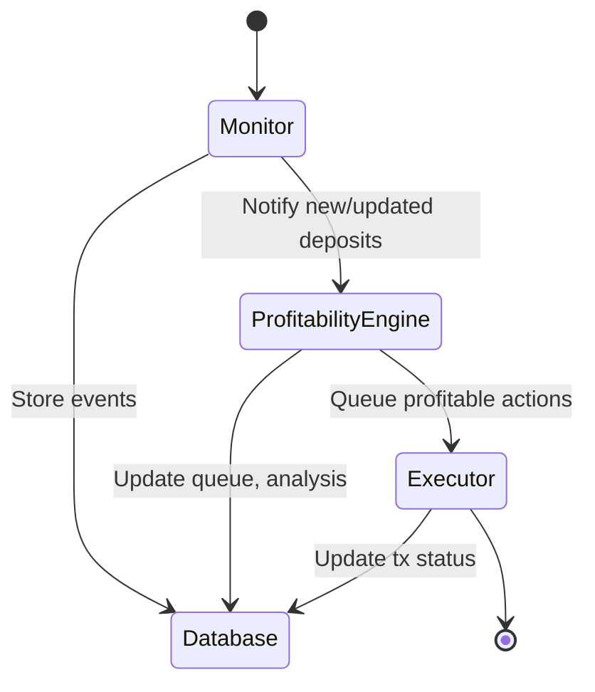
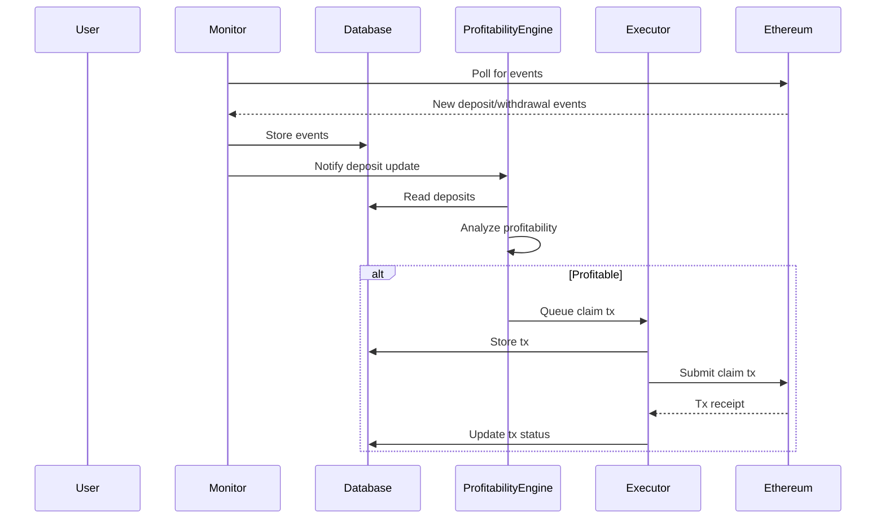

# Rari Staker Profitability Monitor

A modular service for monitoring Rari staking deposits, executing profitable transactions, and claiming rewards.

---

## System Overview

This system is composed of four main components:

- **Monitor**: Tracks on-chain staking events and updates the database.
- **Profitability Engine**: Analyzes deposits for profitable actions and batches.
- **Executor**: Executes profitable transactions and manages the transaction queue.
- **Database**: Persists all state, events, and queue data (supports Supabase and JSON).

---

## High-Level State Diagram



---

## Sequence Diagram: Claiming Rewards



---

## Component Architecture

### 1. Monitor

- Tracks on-chain events (deposits, withdrawals, delegatee changes)
- Groups events by transaction
- Maintains checkpoints for resilience
- Emits events to the profitability engine

### 2. Profitability Engine

- Analyzes deposits for claim profitability
- Optimizes batch size and timing
- Uses price feeds and gas estimates
- Queues profitable claims for execution

### 3. Executor

- Manages transaction queue (FIFO)
- Executes claim transactions (wallet or Defender relayer)
- Handles retries, confirmations, and tip management

### 4. Database

- Stores deposits, events, checkpoints, queues, and claim history
- Supports Supabase (production) and JSON (testing)

---

## Configuration

Configuration is managed via environment variables and `src/configuration/`.

- See `.env.example` for all options.
- Key parameters: RPC_URL, STAKER_CONTRACT_ADDRESS, LST_ADDRESS, EXECUTOR_TYPE, DATABASE_TYPE, etc.

---

## Running the Service

```bash
pnpm run build
pnpm run prod
```

Or run specific components:

```bash
COMPONENTS=monitor,profitability pnpm run prod
```

---

## Health Checks & Maintenance

- Each component exposes health/status logs.
- Use `pnpm run health-check` for status.
- Logs: `output.log` (info), `errors.log` (errors)

---

## Database Schema (Summary)

- `deposits`: Tracks staking deposits
- `processing_checkpoints`: Tracks component state
- `processing_queue`: Manages analysis queue
- `transaction_queue`: Manages tx execution queue

---

## See component READMEs for detailed diagrams and flows.

## Table of Contents

- [Prerequisites](#prerequisites)
- [Installation](#installation)
- [Environment Setup](#environment-setup)
- [Component Architecture](#component-architecture)
- [Configuration Guide](#configuration-guide)
- [Running the Service](#running-the-service)
- [Monitoring and Maintenance](#monitoring-and-maintenance)
- [Troubleshooting](#troubleshooting)

## Prerequisites

Before setting up the service, ensure you have:

1. Node.js v18+ installed
2. PNPM package manager installed (`npm install -g pnpm`)
3. Access to an Ethereum RPC endpoint (e.g., Alchemy, Infura)
4. A wallet with sufficient funds for gas fees
5. (Optional) OpenZeppelin Defender account for production deployments

## Installation

1. Clone the repository:

```bash
git clone <repository-url>
cd staker-bots
```

2. Install dependencies:

```bash
pnpm install
```

3. Create environment configuration:

```bash
cp .env.example .env
```

## Environment Setup

The service requires careful configuration of environment variables. Here's a detailed guide for each section:

### 1. Basic Network Configuration

```env
# Required: RPC endpoint URL
RPC_URL=https://eth-mainnet.g.alchemy.com/v2/your-api-key

# Required: Chain ID (1 for mainnet, 11155111 for sepolia)
CHAIN_ID=1

# Required: Network name
NETWORK_NAME=mainnet

# Optional: Starting block number (defaults to latest if not set)
START_BLOCK=0
```

### 2. Contract Configuration

```env
# Required: Staker contract address
STAKER_CONTRACT_ADDRESS=0x...

# Required: LST token address
LST_ADDRESS=0x...
``` 