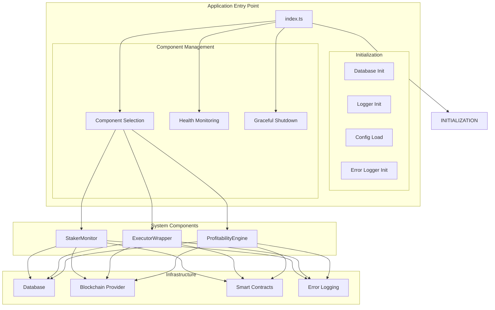
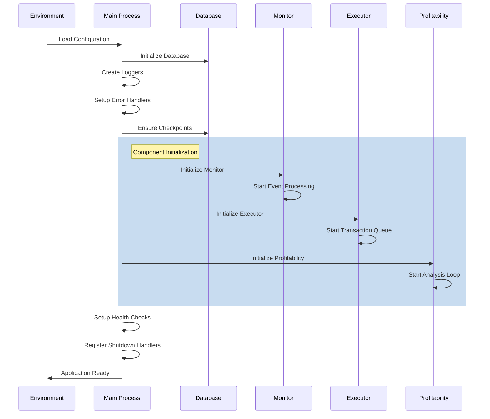
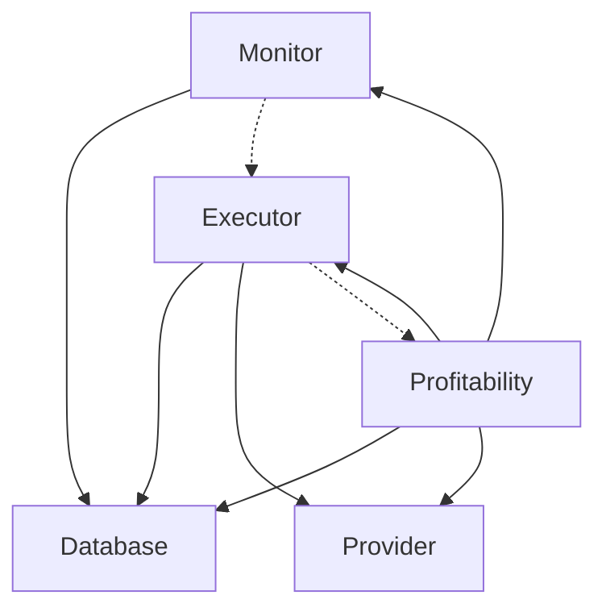
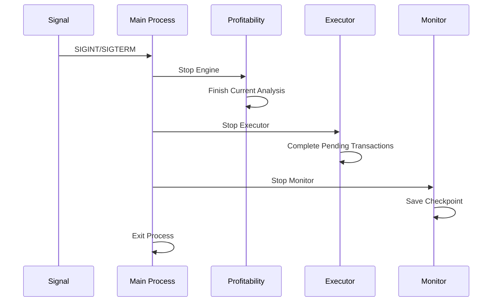

# Main Application Entry Point (index.ts)

## Overview

The main `index.ts` file serves as the application entry point and orchestrates the initialization, startup, and lifecycle management of all system components. It provides a unified interface for running the complete staker-bots system with configurable component selection.

## Architecture



## Startup Sequence



## Component Initialization

### 1. Database Initialization

```typescript
const database = new DatabaseWrapper({
  type: CONFIG.monitor.databaseType as 'json' | 'supabase',
  fallbackToJson: true,
});
```

**Purpose**: Sets up data persistence layer with automatic fallback capability.

### 2. Logger Configuration

```typescript
const loggers = {
  main: new ConsoleLogger('info'),
  monitor: new ConsoleLogger('info', {
    color: '\x1b[34m',
    prefix: '[Monitor]',
  }),
  profitability: new ConsoleLogger('info', {
    color: '\x1b[32m',
    prefix: '[Profitability]',
  }),
  executor: new ConsoleLogger('info', {
    color: '\x1b[33m',
    prefix: '[Executor]',
  }),
};
```

**Features**:

- Color-coded output for visual distinction
- Component-specific prefixes
- Configurable log levels
- Structured logging support

### 3. Error Logger Setup

```typescript
const errorLoggers = {
  main: createErrorLogger('main-service', database),
  monitor: createErrorLogger('monitor-service', database),
  profitability: createErrorLogger('profitability-service', database),
  executor: createErrorLogger('executor-service', database),
};
```

**Purpose**: Centralized error tracking with database persistence.

### 4. Provider Creation

```typescript
function createProvider() {
  if (!CONFIG.monitor.rpcUrl) {
    throw new Error(
      'RPC URL is not configured. Please set RPC_URL environment variable.',
    );
  }
  return new ethers.JsonRpcProvider(CONFIG.monitor.rpcUrl);
}
```

**Validation**: Ensures blockchain connectivity before component initialization.

## Component Selection

### Environment-Based Configuration

```typescript
const rawComponents = process.env.COMPONENTS?.split(',').map((c) =>
  c.trim().toLowerCase(),
) || ['all'];
const componentsToRun = rawComponents.includes('all')
  ? ['monitor', 'executor', 'profitability']
  : rawComponents;
```

### Available Components

1. **monitor**: Blockchain event monitoring
2. **executor**: Transaction execution
3. **profitability**: Profitability analysis
4. **all**: Run all components (default)

### Usage Examples

```bash
# Run all components
COMPONENTS=all npm start

# Run only monitor
COMPONENTS=monitor npm start

# Run executor and profitability
COMPONENTS=executor,profitability npm start
```

## Component Dependencies



**Dependency Rules**:

- All components require Database
- Executor and Profitability require Provider
- Profitability requires Executor
- Monitor can run independently

## Health Monitoring

### Component Health Checks

Each component implements health monitoring with periodic status reporting:

```typescript
setInterval(async () => {
  const status = await component.getStatus();
  logger.info('Component health check:', status);
}, CONFIG.monitor.healthCheckInterval * 1000);
```

### Monitor Health Check

```typescript
{
  isRunning: boolean,
  processingLag: number,
  currentBlock: number,
  lastProcessedBlock: number
}
```

### Executor Health Check

```typescript
{
  isRunning: boolean,
  walletBalance: bigint,
  pendingTransactions: number,
  queueSize: number
}
```

### Profitability Health Check

```typescript
{
  isRunning: boolean,
  lastGasPrice: bigint,
  lastUpdateTimestamp: number,
  queueSize: number
}
```

## Graceful Shutdown

### Signal Handling

```typescript
process.on('SIGINT', () => shutdown('SIGINT'));
process.on('SIGTERM', () => shutdown('SIGTERM'));
```

### Shutdown Sequence



```typescript
async function shutdown(signal: string) {
  mainLogger.info(`Received ${signal}. Starting graceful shutdown...`);

  // Stop components in reverse order
  if (runningComponents.profitabilityEngine) {
    await runningComponents.profitabilityEngine.stop();
  }

  if (runningComponents.executor) {
    await runningComponents.executor.stop();
  }

  if (runningComponents.monitor) {
    await runningComponents.monitor.stop();
  }

  process.exit(0);
}
```

## Error Handling

### Global Error Handlers

```typescript
process.on('uncaughtException', async (error) => {
  await mainErrorLogger.error(error, {
    context: 'uncaught-exception',
    severity: ErrorSeverity.FATAL,
  });
  // Don't exit - allow recovery
});

process.on('unhandledRejection', async (reason) => {
  await mainErrorLogger.error(reason, {
    context: 'unhandled-rejection',
    severity: ErrorSeverity.FATAL,
  });
  // Don't exit - allow recovery
});
```

**Philosophy**: Favor stability over crashes - log errors and continue running.

### Startup Error Handling

```typescript
main().catch(async (error) => {
  await mainErrorLogger.error(error, { context: 'main-function' });
  process.exit(1);
});
```

**Critical Failures**: Exit process only for startup failures.

## Configuration Validation

### Required Environment Variables

The application validates essential configuration at startup:

```typescript
// RPC URL validation
if (!CONFIG.monitor.rpcUrl) {
  throw new Error('RPC URL is not configured');
}

// Contract address validation
if (!CONFIG.monitor.stakerAddress) {
  throw new Error('Staker contract address is not configured');
}

// Executor type validation
if (!['wallet', 'defender', 'relayer'].includes(executorType)) {
  throw new Error(`Invalid executor type: ${executorType}`);
}
```

### Network Connectivity Test

```typescript
try {
  const network = await provider.getNetwork();
  logger.info('Connected to network:', {
    chainId: network.chainId.toString(),
    name: network.name,
  });
} catch (error) {
  throw new Error('Failed to connect to blockchain');
}
```

## Checkpoint Management

### Start Block Enforcement

```typescript
async function ensureCheckpointsAtStartBlock(database, logger, errorLogger) {
  const startBlock = CONFIG.monitor.startBlock;
  const componentTypes = ['staker-monitor', 'executor', 'profitability-engine'];

  for (const componentType of componentTypes) {
    const checkpoint = await database.getCheckpoint(componentType);

    if (!checkpoint || checkpoint.last_block_number < startBlock) {
      await database.updateCheckpoint({
        component_type: componentType,
        last_block_number: startBlock,
        block_hash: '0x0000...',
        last_update: new Date().toISOString(),
      });
    }
  }
}
```

**Purpose**: Ensures all components start from the configured START_BLOCK.

## Deployment Modes

### Development Mode

```bash
NODE_ENV=development
COMPONENTS=all
LOG_LEVEL=debug
DB=json
```

### Production Mode

```bash
NODE_ENV=production
COMPONENTS=all
LOG_LEVEL=info
DB=supabase
TENDERLY_USE_SIMULATE=true
```

### Monitor-Only Mode

```bash
COMPONENTS=monitor
DB=supabase
```

### Executor-Only Mode

```bash
COMPONENTS=executor,profitability
EXECUTOR_TYPE=defender
```

## Best Practices

1. **Component Isolation**: Each component can run independently
2. **Error Recovery**: Non-fatal errors don't crash the application
3. **Resource Cleanup**: Graceful shutdown ensures proper cleanup
4. **Health Monitoring**: Regular status checks for all components
5. **Configuration Validation**: Fail fast on missing critical config
6. **Structured Logging**: Consistent log format across components

This entry point provides a robust foundation for running the staker-bots system in various deployment scenarios while maintaining reliability and observability.
