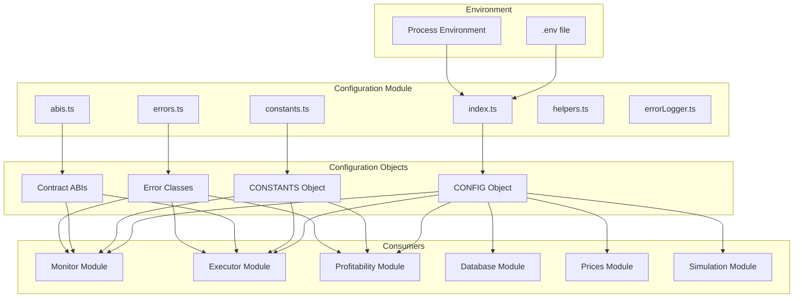
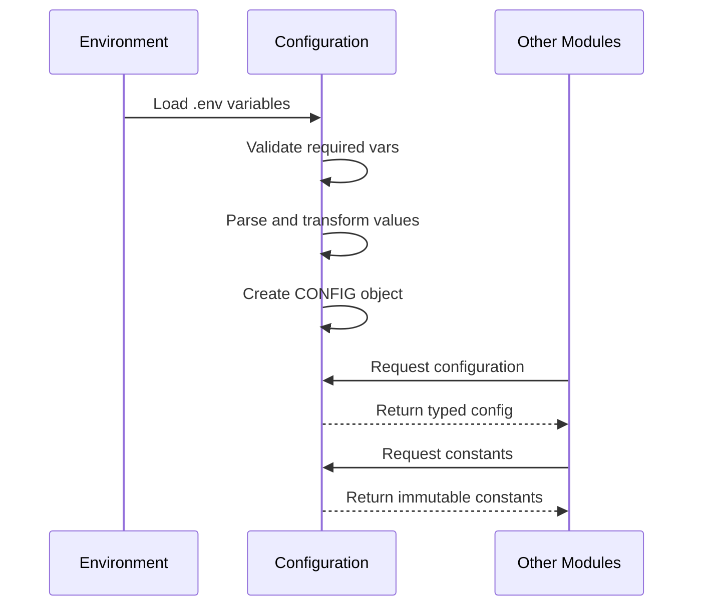
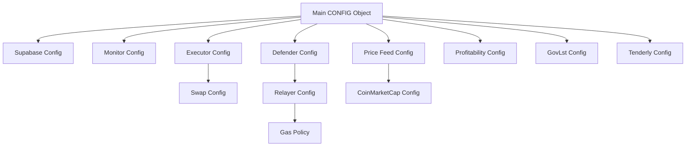

# Configuration Module

## Overview

The Configuration module serves as the central configuration hub for the entire staker-bots system. It manages environment variables, system constants, and provides type-safe configuration objects for all other modules.

## Architecture



## Components

### 1. Main Configuration (`index.ts`)

**Purpose**: Loads environment variables and creates the main CONFIG object.

**Input**:
- Environment variables from `.env` file
- Process environment variables

**Output**:
- `CONFIG` object with all system configuration
- `createProvider()` helper function

**Key Sections**:
- **supabase**: Database connection settings
- **monitor**: Event monitoring configuration
- **executor**: Transaction execution settings
- **defender**: OpenZeppelin Defender integration
- **priceFeed**: Price oracle configuration
- **profitability**: Profit calculation parameters
- **govlst**: GovLst-specific settings
- **tenderly**: Simulation service configuration

### 2. Constants (`constants.ts`)

**Purpose**: Defines immutable system constants organized by domain.

**Categories**:
- **NETWORK_CONSTANTS**: Chain and network parameters
- **TIME_CONSTANTS**: Time durations in seconds
- **GAS_CONSTANTS**: Gas-related settings
- **PROFITABILITY_CONSTANTS**: Profit calculation thresholds
- **DATABASE_CONSTANTS**: Database operation limits
- **CIRCUIT_BREAKER_CONSTANTS**: Failure protection settings
- **GOVLST_CONSTANTS**: Protocol-specific constants
- **MONITOR**: Event monitoring constants
- **EXECUTOR**: Transaction execution constants

### 3. Contract ABIs (`abis.ts`)

**Purpose**: Stores Application Binary Interfaces for smart contracts.

**Contracts**:
- Staker contract ABI
- GovLst contract ABI
- ERC20 token ABI
- Uniswap V3 Router ABI

### 4. Error Classes (`errors.ts`)

**Purpose**: Defines custom error types for better error handling.

**Error Types**:
- `ConfigurationError`: Configuration validation failures
- `GasEstimationError`: Gas calculation errors
- `ProfitabilityError`: Profitability check failures
- `ExecutorError`: Transaction execution errors
- `MonitorError`: Event monitoring errors
- `SimulationError`: Tenderly simulation failures

### 5. Helper Functions (`helpers.ts`)

**Purpose**: Utility functions for configuration validation and transformation.

**Functions**:
- `validateAddress()`: Ethereum address validation
- `parseWei()`: Safe BigInt parsing for Wei values
- `getRequiredEnv()`: Required environment variable getter
- `getOptionalEnv()`: Optional environment variable getter

### 6. Error Logger (`errorLogger.ts`)

**Purpose**: Centralized error logging with context.

**Features**:
- Structured error logging
- Context preservation
- Integration with monitoring services
- Error categorization

## Data Flow



## Configuration Hierarchy



## Environment Variables

### Required Variables
- `RPC_URL`: Ethereum RPC endpoint
- `STAKER_CONTRACT_ADDRESS`: Staker contract address
- `CHAIN_ID`: Ethereum chain ID
- `LST_ADDRESS`: Liquid staking token address

### Optional Variables
- `SUPABASE_URL`: Database URL
- `SUPABASE_KEY`: Database authentication key
- `PRIVATE_KEY`: Executor wallet private key
- `DEFENDER_API_KEY`: OpenZeppelin Defender API key
- `TENDERLY_ACCESS_KEY`: Tenderly simulation key
- `COINMARKETCAP_API_KEY`: Price feed API key

## Usage Example

```typescript
import { CONFIG, CONSTANTS, createProvider } from '@/configuration';

// Access configuration
const minBalance = CONFIG.executor.wallet.minBalance;
const gasBuffer = CONSTANTS.GAS.GAS_PRICE_BUFFER;

// Create provider
const provider = createProvider();

// Use contract ABIs
import { STAKER_ABI } from '@/configuration';
const contract = new ethers.Contract(address, STAKER_ABI, provider);
```

## Best Practices

1. **Environment Variables**: Always use environment variables for sensitive data
2. **Type Safety**: Leverage TypeScript's const assertions for immutability
3. **Validation**: Validate all required configuration at startup
4. **Defaults**: Provide sensible defaults for optional configuration
5. **Organization**: Group related configuration together
6. **Documentation**: Document all configuration options and their effects

## Error Handling

The module validates configuration at startup and throws descriptive errors:

```typescript
// Missing required variable
throw new Error(`Missing required environment variable: ${envVar}`);

// Invalid configuration
throw new ConfigurationError('Invalid address format', { address });

// Type validation
if (isNaN(parseInt(value))) {
  throw new ConfigurationError('Invalid numeric value', { value });
}
```

## Integration Points

- **All Modules**: Import CONFIG and CONSTANTS
- **Smart Contracts**: Use provided ABIs
- **Error Handling**: Extend custom error classes
- **Provider Creation**: Use createProvider() helper
- **Logging**: Integrate with ErrorLogger

This module forms the foundation of the entire system, ensuring consistent configuration across all components.