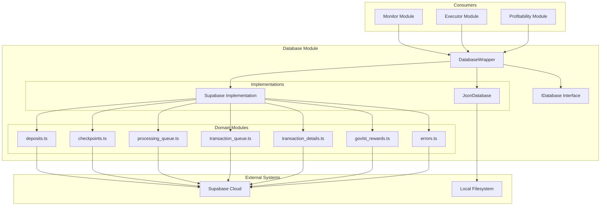
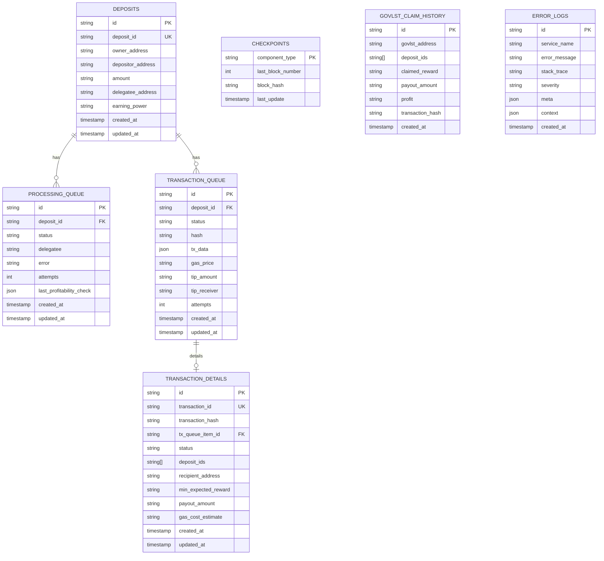
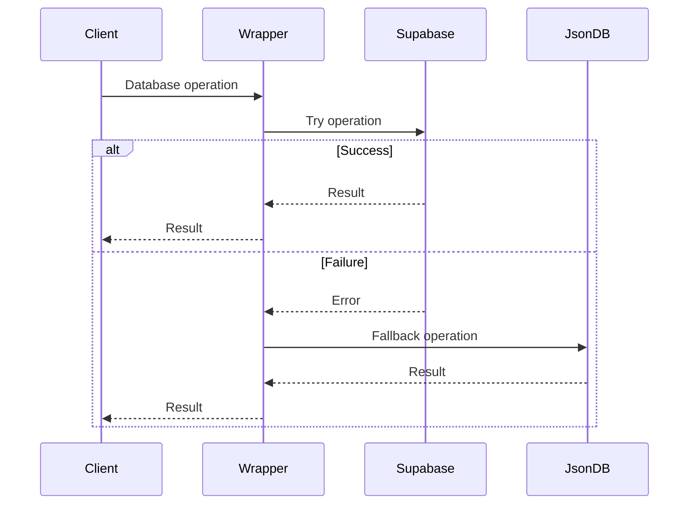
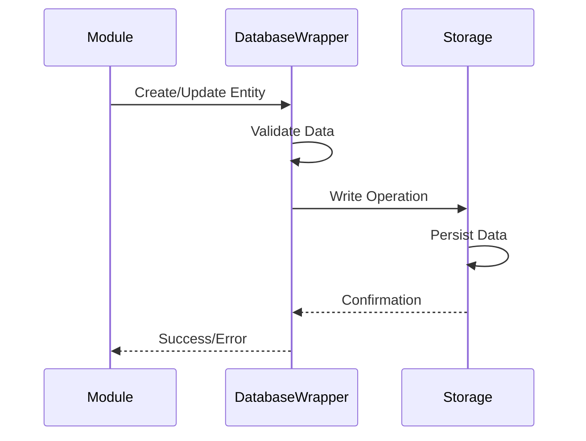
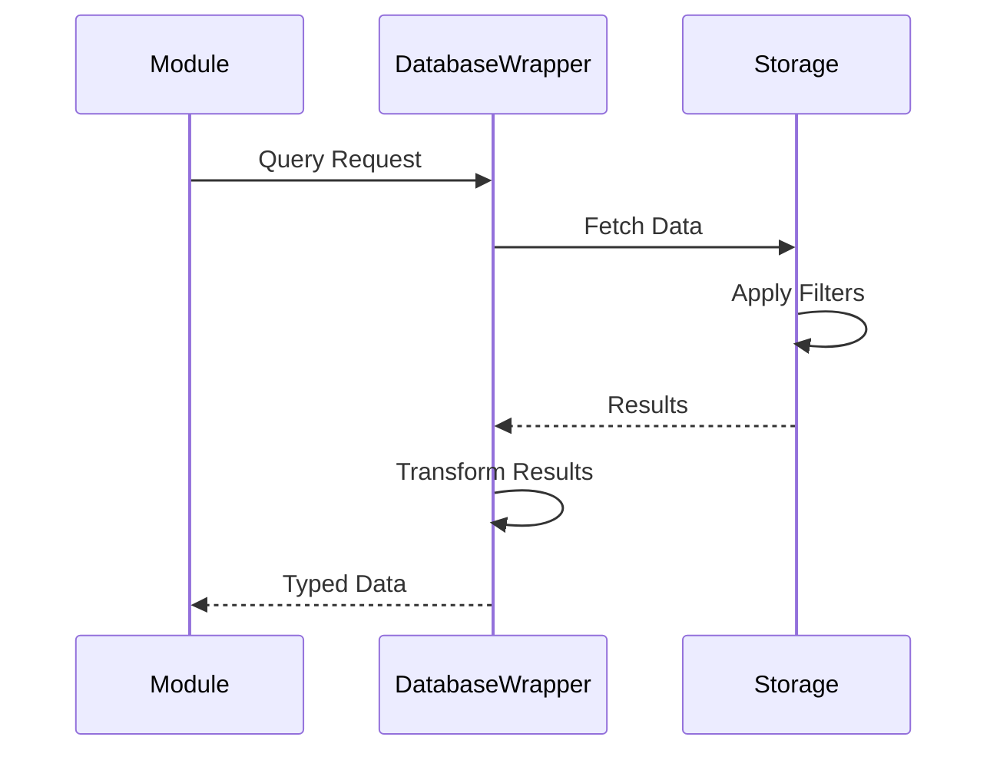

# Database Module

## Overview

The Database module provides a flexible data persistence layer for the staker-bots system. It supports multiple storage backends (Supabase and JSON) with automatic fallback capabilities, ensuring data integrity and availability.

## Architecture



## Data Model



## Components

### 1. Database Interface (`IDatabase`)

**Purpose**: Defines the contract for all database implementations.

**Key Method Categories**:
- **Deposits**: CRUD operations for staking deposits
- **Checkpoints**: Block processing state management
- **Processing Queue**: Profitability check queue management
- **Transaction Queue**: Transaction execution queue management
- **Transaction Details**: Detailed transaction tracking
- **GovLst Claims**: Reward claim history
- **Error Logs**: System error tracking

### 2. DatabaseWrapper

**Purpose**: Provides automatic fallback between database implementations.

**Features**:
- Primary database selection (Supabase/JSON)
- Automatic fallback to JSON on Supabase failure
- Transparent error handling
- Method wrapping for all database operations

**Flow**:


### 3. Supabase Implementation

**Purpose**: Cloud-based database storage using Supabase.

**Structure**:
- `client.ts`: Supabase client initialization
- `deposits.ts`: Deposit operations
- `checkpoints.ts`: Checkpoint operations
- `processing_queue.ts`: Processing queue operations
- `transaction_queue.ts`: Transaction queue operations
- `transaction_details.ts`: Transaction detail operations
- `govlst_rewards.ts`: GovLst claim operations
- `errors.ts`: Error log operations
- `migrations/`: SQL migration files

### 4. JSON Database Implementation

**Purpose**: Local file-based storage for development and fallback.

**Features**:
- In-memory data with file persistence
- Thread-safe write operations
- Automatic file creation
- Data migration support
- Query simulation for complex operations

## Data Flow

### Write Operations



### Read Operations



## Key Tables

### 1. Deposits
- Tracks all staking deposits
- Links owners, depositors, and delegatees
- Stores amounts and earning power

### 2. Processing Queue
- Manages deposits awaiting profitability checks
- Tracks check attempts and results
- Maintains processing status

### 3. Transaction Queue
- Queues profitable claims for execution
- Tracks transaction submission status
- Stores gas prices and tip information

### 4. Transaction Details
- Comprehensive transaction execution records
- Links multiple deposits to single transaction
- Tracks profitability calculations and actual results

### 5. Checkpoints
- Maintains blockchain synchronization state
- Prevents reprocessing of blocks
- Handles chain reorganizations

### 6. Error Logs
- Centralized error tracking
- Categorized by service and severity
- Includes context and metadata

## Usage Examples

### Creating a Deposit
```typescript
await database.createDeposit({
  deposit_id: '12345',
  owner_address: '0x...',
  amount: '1000000000000000000',
  delegatee_address: '0x...',
  created_at: new Date().toISOString(),
  updated_at: new Date().toISOString()
});
```

### Processing Queue Management
```typescript
// Add to queue
const item = await database.createProcessingQueueItem({
  deposit_id: '12345',
  status: ProcessingQueueStatus.PENDING,
  delegatee: '0x...'
});

// Update status
await database.updateProcessingQueueItem(item.id, {
  status: ProcessingQueueStatus.PROCESSING,
  last_profitability_check: JSON.stringify(checkResult)
});
```

### Transaction Tracking
```typescript
// Create transaction details
await database.createTransactionDetails({
  transaction_id: 'tx-123',
  deposit_ids: ['12345', '67890'],
  status: TransactionDetailsStatus.PENDING,
  min_expected_reward: '1000000000000000000',
  gas_cost_estimate: '50000000000000000'
});
```

## Migration System

SQL migrations are automatically applied on startup:
1. Core tables (deposits, checkpoints)
2. Monitor tables (processing states)
3. Queue tables (transaction management)
4. GovLst tables (reward tracking)
5. View definitions
6. Error tracking tables
7. Transaction detail enhancements

## Error Handling

The module implements comprehensive error handling:
- Automatic retry logic for transient failures
- Fallback to JSON database on persistent errors
- Error logging with full context
- Graceful degradation of functionality

## Best Practices

1. **Always use the interface**: Never directly access implementations
2. **Handle errors gracefully**: The database may fallback to JSON
3. **Use transactions**: Group related operations when possible
4. **Index considerations**: Add indexes for frequently queried fields
5. **Data validation**: Validate before writing to database

## Performance Considerations

- **Batch operations**: Use batch methods for multiple items
- **Connection pooling**: Supabase client reuses connections
- **JSON file size**: Monitor JSON database file growth
- **Query optimization**: Use specific queries over getAllX methods
- **Caching**: Implement caching for frequently accessed data

This module ensures reliable data persistence across different deployment scenarios, from local development to production cloud environments.