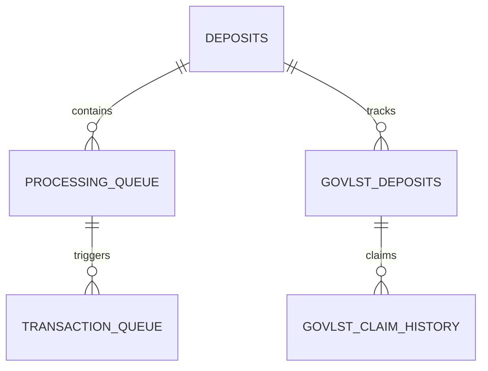
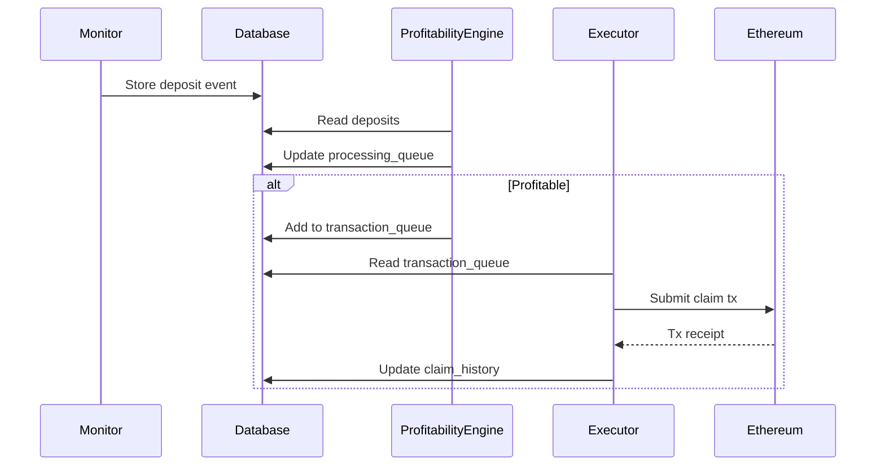

# Database Component

The database component provides a storage layer for the staker-bots system. It supports both Supabase and local JSON file storage.

---

## State Diagram: Table Relationships



---

## Sequence Diagram: Deposit to Claim Flow



---

## Schema Overview

- **deposits**: Tracks staking deposits
- **processing_checkpoints**: Tracks component state
- **govlst_deposits**: Tracks GovLst-owned deposits
- **govlst_claim_history**: Records claim executions
- **processing_queue**: Manages analysis queue
- **transaction_queue**: Manages tx execution queue

---

## Integration

- **Monitor**: Writes events and deposits
- **Profitability Engine**: Reads deposits, updates queues
- **Executor**: Reads/writes transaction and claim history

---

## See root README for system-level diagrams and configuration.

## Database Schema

The database schema is organized into logical components:

1. **Core Tables** - Contains the core tables like deposits and processing_checkpoints
2. **Monitor Tables** - Tables used by the monitor component
3. **Queue Tables** - Tables for processing and transaction queues
4. **GovLst Tables** - Tables specific to the GovLst functionality

## Running Migrations

All migrations have been consolidated into sequential files that must be run in the correct order:

```
01_core_tables.sql    - Core tables with base schema
02_monitor_tables.sql - Monitor-related tables
03_queue_tables.sql   - Queue-related tables
04_govlst_tables.sql  - GovLst-related tables
05_checkpoints_view.sql - Compatibility view for checkpoints
```

To apply migrations:

```bash
# Using the npm script
npm run migrate

# Or directly
npx tsx src/database/supabase/migrate.ts
```

## Manual Setup

If you prefer to manually set up the database:

1. Go to [Supabase Dashboard](https://app.supabase.com)
2. Select your project
3. Go to SQL Editor
4. Click "New Query"
5. Copy and paste the contents of each migration file in sequence:
   - `src/database/supabase/migrations/01_core_tables.sql`
   - `src/database/supabase/migrations/02_monitor_tables.sql`
   - `src/database/supabase/migrations/03_queue_tables.sql`
   - `src/database/supabase/migrations/04_govlst_tables.sql`
   - `src/database/supabase/migrations/05_checkpoints_view.sql`
6. Run each migration in order

## Database Structure

### Tables

#### Core Tables (01_core_tables.sql)

- **deposits**

  - `deposit_id` (TEXT, PK): Unique identifier for each deposit
  - `owner_address` (TEXT): Address of the deposit owner
  - `depositor_address` (TEXT): Address of the depositor
  - `delegatee_address` (TEXT): Address of the delegatee
  - `amount` (NUMERIC): Amount of deposit
  - `earning_power` (TEXT): Earning power of the deposit
  - `created_at` (TIMESTAMP): Auto-set on creation
  - `updated_at` (TIMESTAMP): Auto-updates on changes

- **processing_checkpoints**
  - `component_type` (TEXT, PK): Type of the processing component
  - `last_block_number` (BIGINT): Last processed block number
  - `block_hash` (TEXT): Hash of the last processed block
  - `last_update` (TIMESTAMP): Time of last update

#### Monitor Tables (02_monitor_tables.sql)

- **score_events**
  - `delegatee` (TEXT): Delegatee address (part of PK)
  - `score` (NUMERIC): Score value
  - `block_number` (BIGINT): Block number (part of PK)
  - `created_at` (TIMESTAMP): Auto-set on creation
  - `updated_at` (TIMESTAMP): Auto-updates on changes

#### Queue Tables (03_queue_tables.sql)

- **processing_queue**

  - `id` (UUID, PK): Unique identifier
  - `deposit_id` (TEXT): Reference to deposit
  - `status` (TEXT): Status of processing
  - `delegatee` (TEXT): Delegatee address
  - `attempts` (INTEGER): Number of processing attempts
  - `error` (TEXT): Error message if failed
  - `last_profitability_check` (TEXT): JSON stringified profitability result

- **transaction_queue**
  - `id` (UUID, PK): Unique identifier
  - `deposit_id` (TEXT): Reference to deposit
  - `status` (TEXT): Status of transaction
  - `hash` (TEXT): Transaction hash
  - `attempts` (INTEGER): Number of submission attempts
  - `error` (TEXT): Error message if failed
  - `tx_data` (TEXT): JSON stringified transaction data
  - `gas_price` (TEXT): Gas price used
  - `tip_amount` (TEXT): Tip amount
  - `tip_receiver` (TEXT): Tip receiver address

#### GovLst Tables (04_govlst_tables.sql)

- **govlst_deposits**

  - `deposit_id` (TEXT, PK): Unique identifier (references deposits)
  - `govlst_address` (TEXT): Address of the GovLst contract
  - `last_reward_check` (TIMESTAMP): Time of last reward check
  - `last_unclaimed_reward` (TEXT): Amount of unclaimed rewards
  - `created_at` (TIMESTAMP): Auto-set on creation
  - `updated_at` (TIMESTAMP): Auto-updates on changes

- **govlst_claim_history**
  - `id` (UUID, PK): Unique identifier for each claim
  - `govlst_address` (TEXT): Address of the GovLst contract
  - `deposit_ids` (JSONB): Array of claimed deposit IDs
  - `claimed_reward` (TEXT): Total claimed reward amount
  - `payout_amount` (TEXT): GovLst payout amount at time of claim
  - `profit` (TEXT): Net profit from the claim
  - `transaction_hash` (TEXT): Hash of the claim transaction
  - `gas_used` (TEXT): Gas used by the transaction
  - `gas_price` (TEXT): Gas price for the transaction
  - `created_at` (TIMESTAMP): Time of claim execution
  - `updated_at` (TIMESTAMP): Auto-updates on changes

## Usage Example

```typescript
import { DatabaseWrapper } from '@/database';

// Supabase database (default)
const supabaseDb = new DatabaseWrapper();

// Local JSON database
const jsonDb = new DatabaseWrapper({
  type: 'json',
  jsonDbPath: '.my-local-db.json', // optional, defaults to '.local-db.json'
});

// Create deposit
await supabaseDb.createDeposit({
  deposit_id: '123',
  owner_address: '0x...',
  depositor_address: '0x...',
  delegatee_address: '0x...',
  amount: '1000000000000000000',
  created_at: new Date().toISOString(),
  updated_at: new Date().toISOString(),
});
```

## Local JSON Database

The package includes a simple JSON-based database implementation for local development and testing. The JSON database stores all data in a local file and implements the same interface as the Supabase database.

To use the JSON database:

1. Initialize the DatabaseWrapper with the 'json' type
2. Optionally specify a custom path for the database file
3. The database file will be automatically created if it doesn't exist

The JSON database is suitable for:

- Local development
- Testing
- Simple deployments that don't require a full database
- Scenarios where you want to avoid external dependencies

Note that the JSON database is not recommended for production use cases that require:

- Concurrent access
- High performance
- Data redundancy
- Complex queries

## Error Logging

The database layer includes support for logging errors to both Supabase and the local JSON database.

### Error Log Schema

The error logs are stored in the `errors` table with the following schema:

```
id               - UUID (primary key)
service_name     - Text (the name of the service generating the error)
error_message    - Text (the main error message)
stack_trace      - Text (optional stack trace from the error)
severity         - Text ('info', 'warn', 'error', 'fatal')
meta             - JSONB (additional metadata about the error)
context          - JSONB (context information about where the error occurred)
created_at       - Timestamp (when the error was logged)
```

### Error Logging Methods

The following methods are available for error logging:

```typescript
// Create a new error log
await db.createErrorLog({
  service_name: 'my-service',
  error_message: 'Something went wrong',
  severity: 'error',
  stack_trace: new Error().stack,
  meta: { additionalInfo: 'value' },
  context: { requestId: '123' },
});

// Retrieve error logs with pagination
const recentErrors = await db.getErrorLogs(10, 0); // limit 10, offset 0

// Get errors for a specific service
const serviceErrors = await db.getErrorLogsByService('my-service', 50, 0);

// Get errors by severity
const criticalErrors = await db.getErrorLogsBySeverity('fatal', 20, 0);

// Delete an error log
await db.deleteErrorLog('error-id');
```

### Using the Error Logger

For a higher-level API, you can use the `ErrorLogger` class in the `src/configuration/errorLogger.ts` file:

```typescript
import { createErrorLogger } from '@/configuration/errorLogger';
import { dbWrapper } from '@/database';

// Create an error logger for a specific service
const logger = createErrorLogger('my-service', dbWrapper);

// Log different severity levels
await logger.info('Operation started', { operationId: '123' });
await logger.warn('Resource usage high', { cpuUsage: 89 });
await logger.error(new Error('Operation failed'), { operationId: '123' });
await logger.fatal('Critical system failure', { component: 'auth' });

// Or use the generic logError method
await logger.logError(error, 'error', { additionalContext: 'value' });
```

The logger automatically extracts context from `BaseError` types, making it easy to integrate with the existing error system.
