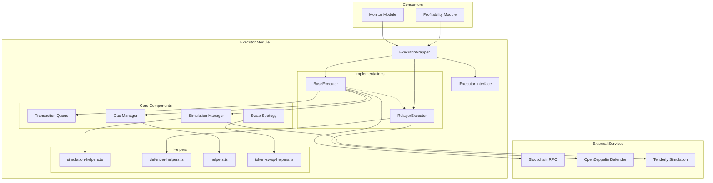
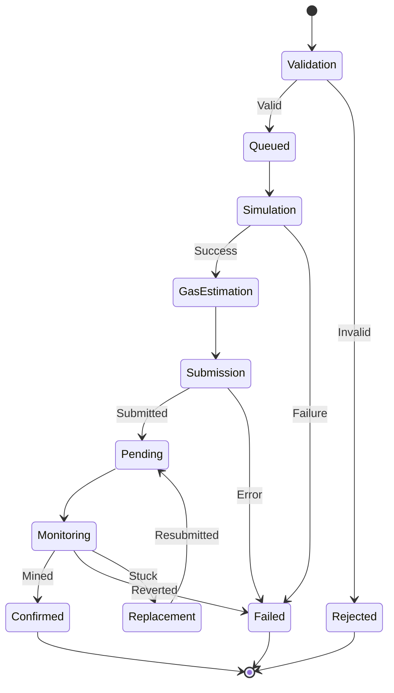
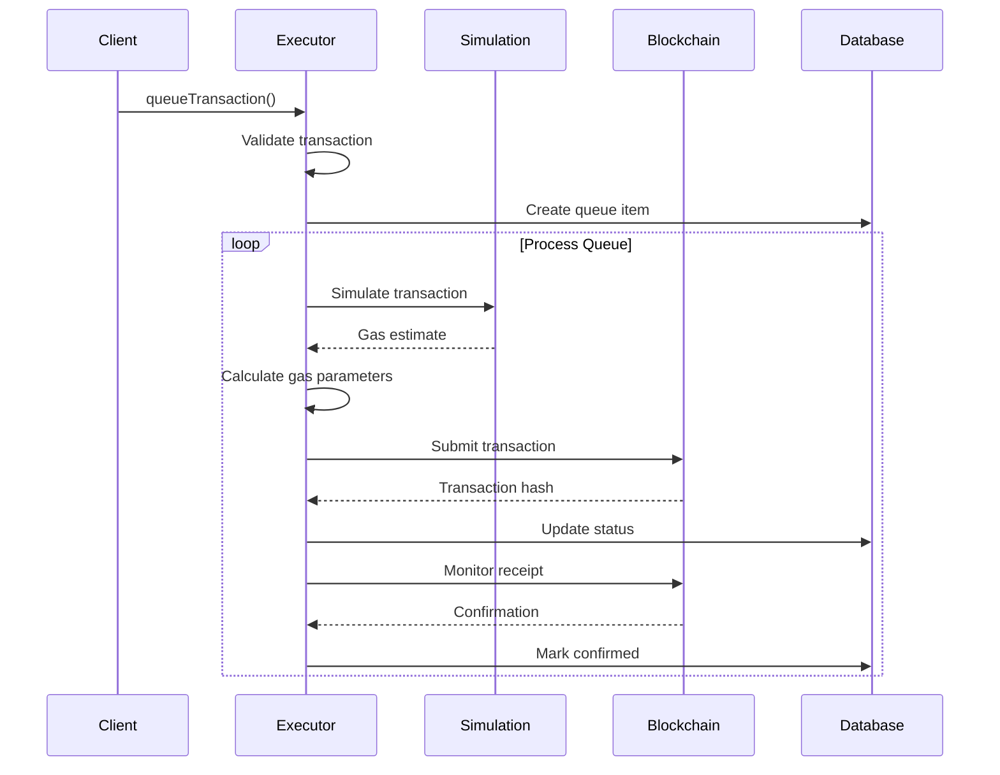
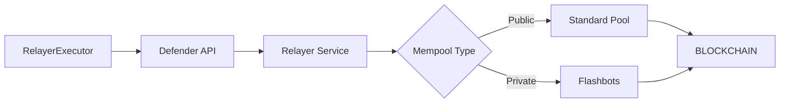
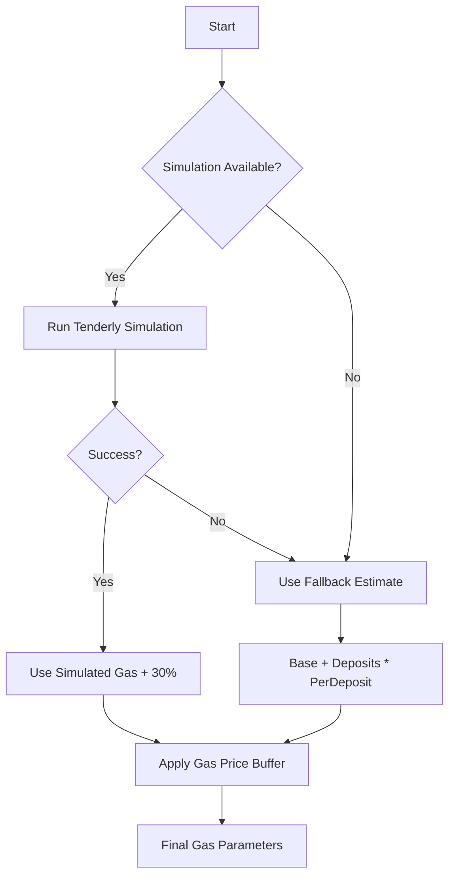
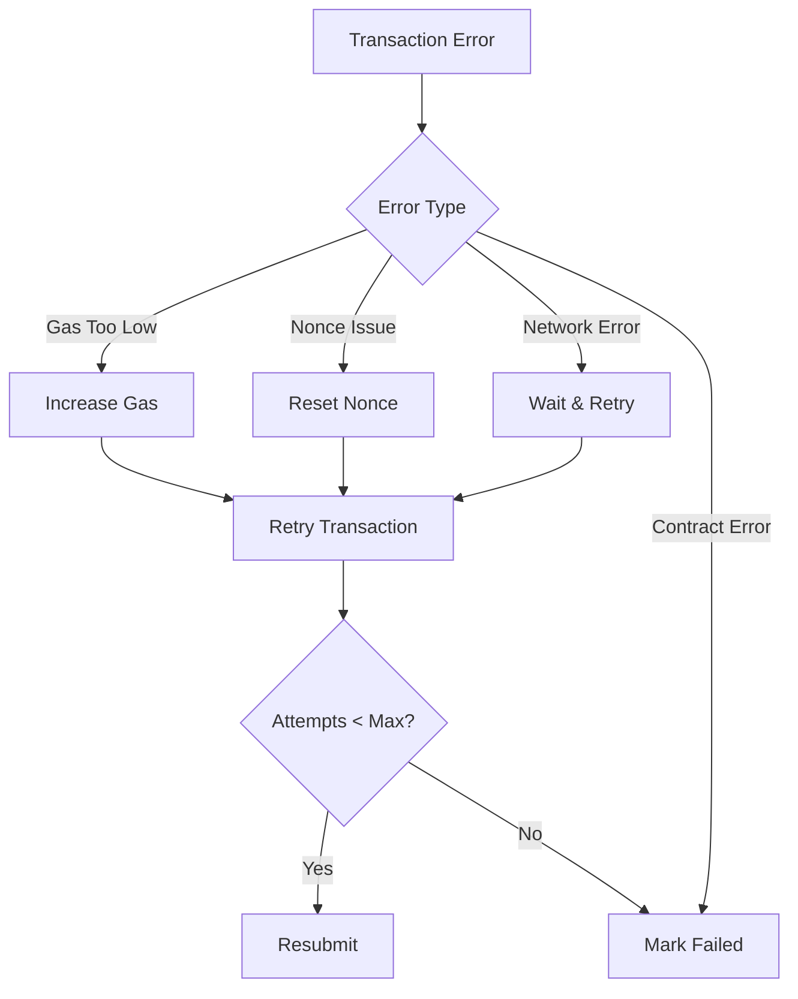

# Executor Module

## Overview

The Executor module manages the submission and monitoring of profitable reward claim transactions. It provides multiple execution strategies (direct wallet, OpenZeppelin Defender) with comprehensive gas management, simulation, and error recovery capabilities.

## Architecture



## Transaction Lifecycle



## Components

### 1. ExecutorWrapper

**Purpose**: Factory and manager for executor implementations.

**Responsibilities**:

- Creates appropriate executor instance based on configuration
- Provides unified interface
- Manages executor lifecycle

### 2. BaseExecutor

**Purpose**: Direct wallet-based transaction execution.

**Key Features**:

- In-memory transaction queue
- Gas price optimization
- Transaction simulation
- Automatic retry logic
- Tip accumulation and transfer

**Process Flow**:



### 3. RelayerExecutor

**Purpose**: OpenZeppelin Defender-based execution.

**Key Features**:

- Managed gas pricing
- Private mempool options
- MEV protection
- Enhanced monitoring
- Automatic balance management

**Defender Integration**:



### 4. Transaction Queue

**States**:

- `QUEUED`: Awaiting processing
- `PENDING`: Submitted to network
- `CONFIRMED`: Successfully mined
- `FAILED`: Execution failed
- `REPLACED`: Resubmitted with higher gas

**Queue Processing**:

```typescript
// Process every 3 seconds
setInterval(() => processQueue(), 3000)

// Priority order:
1. Failed transactions (retry)
2. Queued transactions (new)
3. Stuck transactions (replace)
```

### 5. Gas Management

**Gas Estimation Flow**:



**Gas Calculation**:

```typescript
// Base calculation
gasLimit = BASE_GAS + depositCount * GAS_PER_DEPOSIT;

// With reentrancy protection (20+ deposits)
if (depositCount >= 20) {
  gasLimit *= 1.25; // 25% additional buffer
}

// Price calculation
gasPrice = currentGasPrice * (1 + buffer);
maxFeePerGas = baseFee * 2 + priorityFee;
```

### 6. Simulation Integration

**Purpose**: Pre-execution validation and accurate gas estimation.

**Process**:

1. Encode transaction data
2. Set simulation parameters
3. Run Tenderly simulation
4. Extract gas usage
5. Apply safety buffer

**Benefits**:

- Prevents failed transactions
- Accurate gas estimates
- Error detection before submission
- Cost optimization

## Error Handling

### Retry Strategy



### Error Types

1. **ValidationError**: Invalid transaction parameters
2. **GasEstimationError**: Failed to estimate gas
3. **InsufficientBalanceError**: Wallet balance too low
4. **TransactionExecutionError**: Submission failed
5. **SimulationError**: Tenderly simulation failed

## Configuration

### Wallet Executor

```typescript
{
  privateKey: string,
  minBalance: bigint,        // Minimum wallet balance
  maxPendingTransactions: 5, // Concurrent tx limit
  transferOutThreshold: 0.5, // ETH threshold for tips
  gasBoostPercentage: 25,    // Gas price buffer %
  minProfitMargin: 10        // Minimum profit %
}
```

### Relayer Executor

```typescript
{
  apiKey: string,
  apiSecret: string,
  isPrivate: boolean,        // Use Flashbots
  gasPolicy: {
    maxFeePerGas: bigint,
    maxPriorityFeePerGas: bigint
  }
}
```

## Transaction Validation

### Pre-submission Checks

1. **Sufficient Rewards**: Total rewards > payout + gas + margin
2. **Valid Deposits**: All deposits exist and qualify
3. **Gas Estimation**: Successful simulation or fallback
4. **Balance Check**: Executor has sufficient ETH
5. **Queue Limits**: Not exceeding max queue size

### Post-submission Monitoring

1. **Receipt Polling**: Check transaction status
2. **Timeout Detection**: Identify stuck transactions
3. **Replacement Logic**: Resubmit with higher gas
4. **Success Verification**: Validate execution results

## Best Practices

1. **Always Simulate**: Use Tenderly when available
2. **Monitor Gas Prices**: Adjust buffers for volatility
3. **Set Appropriate Limits**: Balance speed vs cost
4. **Handle Failures Gracefully**: Implement retry logic
5. **Track Metrics**: Monitor success rates and costs

## Common Issues and Solutions

### Issue: Transaction Stuck

**Solution**: Automatic replacement after timeout with higher gas

### Issue: Simulation Failures

**Solution**: Fallback to conservative gas estimates

### Issue: Insufficient Balance

**Solution**: Alert and pause execution until funded

### Issue: High Failure Rate

**Solution**: Circuit breaker activates after threshold

## Performance Metrics

- **Queue Processing**: Every 3 seconds
- **Transaction Timeout**: 5 minutes
- **Max Retries**: 3 attempts
- **Simulation Success Rate**: >95%
- **Transaction Success Rate**: >98%

## Integration Points

- **Profitability Module**: Receives profitable batches
- **Database Module**: Persists transaction state
- **Simulation Module**: Validates transactions
- **Price Module**: Gas cost calculations
- **Monitor Module**: Triggers execution

This module ensures reliable and cost-effective execution of reward claims while protecting against common blockchain transaction failures.
