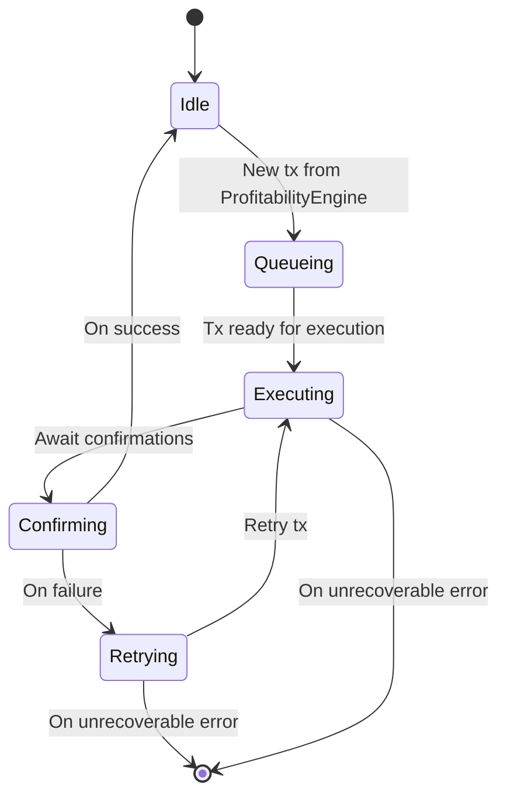
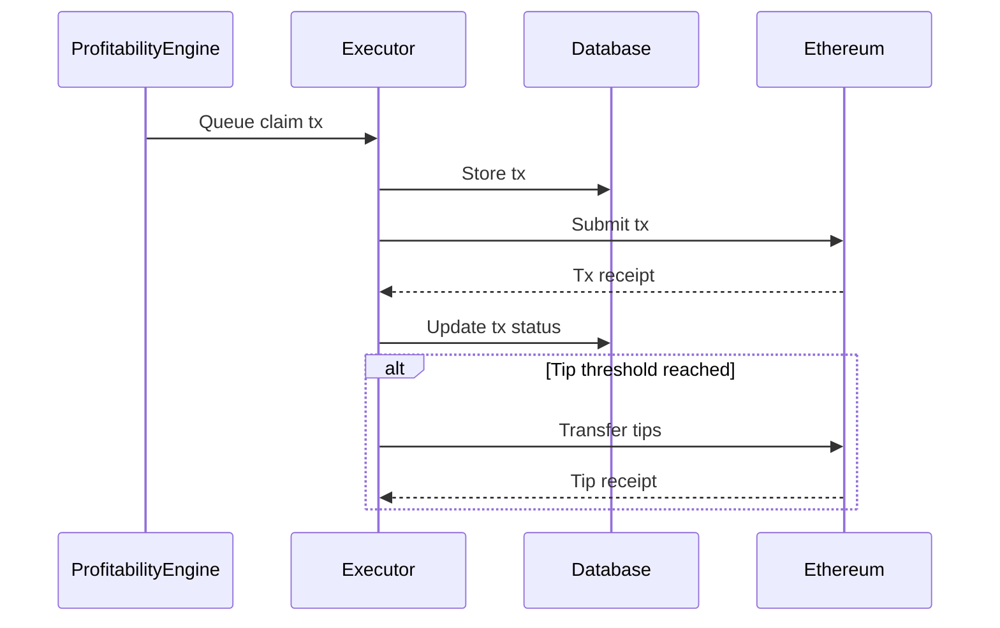

# Executor Component

The Executor component manages and executes GovLst reward claim transactions in a controlled, efficient manner. It handles wallet management, batch transaction queueing, execution, and tip collection.

## Core Features

### 1. Wallet Management

- Secure private key handling
- Balance monitoring with minimum thresholds
- Automatic tip collection when threshold reached
- Gas price optimization with configurable boost
- Support for both direct wallet and OpenZeppelin Defender Relayer

### 2. Transaction Queue

- FIFO (First In, First Out) batch processing
- Configurable queue size limits
- Concurrent transaction execution
- Transaction status tracking (QUEUED → PENDING → CONFIRMED/FAILED)
- Automatic retry mechanism for failed transactions
- Batch size optimization

### 3. Transaction Execution

- Gas price optimization with configurable boost percentage
- Batch gas estimation with safety buffers
- Confirmation monitoring with configurable confirmations
- Enhanced error handling and logging
- Transaction receipt tracking with ethers.js v6 compatibility

### 4. Tip Management

- Automatic transfer of accumulated tips to configured receiver
- Configurable transfer threshold
- Gas cost calculation and optimization
- Support for both wallet and relayer implementations

## Usage

```typescript
import { ExecutorWrapper, ExecutorType } from './executor';
import { GovLstProfitabilityCheck } from '@/profitability/interfaces/types';

// Initialize with custom configuration
const executor = new ExecutorWrapper(
  govLstContract,
  provider,
  ExecutorType.WALLET, // or ExecutorType.RELAYER
  {
    wallet: {
      privateKey: process.env.PRIVATE_KEY,
      minBalance: ethers.parseEther('0.1'), // 0.1 ETH
      maxPendingTransactions: 5,
    },
    maxQueueSize: 100,
    minConfirmations: 2,
    maxRetries: 3,
    retryDelayMs: 5000,
    transferOutThreshold: ethers.parseEther('0.5'), // 0.5 ETH
    gasBoostPercentage: 10, // 10%
    concurrentTransactions: 3,
  },
);

// Start the executor
await executor.start();

// Queue a batch transaction
const depositIds = [1n, 2n, 3n].map(BigInt);
const profitability: GovLstProfitabilityCheck = {
  is_profitable: true,
  constraints: {
    has_enough_shares: true,
    meets_min_reward: true,
    is_profitable: true,
  },
  estimates: {
    total_shares: BigInt(1000),
    payout_amount: ethers.parseEther('1'),
    gas_estimate: BigInt(500000),
    expected_profit: ethers.parseEther('0.5'),
  },
};

const tx = await executor.queueTransaction(depositIds, profitability);

// Monitor transaction status
const status = await executor.getTransaction(tx.id);

// Get queue statistics
const stats = await executor.getQueueStats();

// Transfer accumulated tips
await executor.transferOutTips();

// Stop the executor
await executor.stop();
```

## Configuration

| Parameter                       | Description                                    | Default  |
| ------------------------------- | ---------------------------------------------- | -------- |
| `wallet.privateKey`             | Private key for transaction signing            | Required |
| `wallet.minBalance`             | Minimum balance to maintain                    | 0.1 ETH  |
| `wallet.maxPendingTransactions` | Maximum concurrent pending transactions        | 5        |
| `maxQueueSize`                  | Maximum size of transaction queue              | 100      |
| `minConfirmations`              | Required confirmations for transactions        | 2        |
| `maxRetries`                    | Maximum retry attempts for failed transactions | 3        |
| `retryDelayMs`                  | Delay between retry attempts                   | 5000     |
| `transferOutThreshold`          | Balance threshold for tip transfer             | 0.5 ETH  |
| `gasBoostPercentage`            | Percentage to boost gas price                  | 10       |
| `concurrentTransactions`        | Maximum concurrent transactions                | 3        |

## State Diagram



## Sequence Diagram: Transaction Execution



## Architecture

The component follows a modular architecture with clear separation of concerns:

```
executor/
├── interfaces/         # Type definitions and interfaces
│   ├── IExecutor.ts   # Executor interface
│   └── types.ts       # Shared types and interfaces
├── strategies/         # Implementation strategies
│   ├── BaseExecutor.ts    # Wallet-based executor
│   └── RelayerExecutor.ts # Defender-based executor
├── constants.ts        # Default configuration and constants
├── ExecutorWrapper.ts  # Main wrapper class
└── index.ts           # Public exports
```

## Error Handling

The executor implements a robust, type-safe error handling system with dedicated error classes:

### Error Classes

- `ExecutorError`: Base error class for executor-related errors

  - Includes context and retryable flag
  - Used for general executor state errors

- `TransactionExecutionError`: For transaction execution failures

  - Includes transaction ID and deposit details
  - Most transaction errors are retryable

- `GasEstimationError`: For gas estimation failures

  - Includes estimation parameters
  - Generally retryable

- `ContractMethodError`: For missing/invalid contract methods

  - Includes method name
  - Non-retryable, requires code fix

- `QueueOperationError`: For queue operation failures

  - Includes queue state information
  - Generally retryable

- `TransactionValidationError`: For invalid transaction parameters

  - Includes validation context
  - Non-retryable, requires valid input

- `InsufficientBalanceError`: For low wallet/relayer balance

  - Includes current and required balance
  - Retryable once funds are added

- `TransactionReceiptError`: For missing/invalid receipts
  - Includes transaction hash and context
  - May be retryable (network issues)

### Error Handling Pattern

```typescript
try {
  await executor.queueTransaction(depositIds, profitability);
} catch (error) {
  if (error instanceof ExecutorError) {
    console.error('Executor error:', {
      message: error.message,
      context: error.context,
      isRetryable: error.isRetryable,
    });

    if (error.isRetryable) {
      // Implement retry logic
    }
  }
}
```

### Error Context

All errors include relevant context for debugging:

- Transaction IDs
- Deposit IDs
- Gas parameters
- Balance information
- Contract state
- Validation details

### Error Propagation

The ExecutorWrapper provides a consistent error handling layer:

- Wraps all underlying errors in appropriate error classes
- Adds execution context to errors
- Preserves error traceability
- Maintains type safety through the error hierarchy

### Logging

Errors are automatically logged with:

- Error type and message
- Full error context
- Stack trace when available
- Retry status
- Related transaction/deposit IDs

## Monitoring

- Health/status via `getStatus()`
- Metrics: queue size, pending txs, wallet balance, last error

## Testing

A comprehensive test suite is included that verifies:

- Batch queue management
- Transaction execution with GovLst contract
- Status monitoring and receipt handling
- Error handling and recovery
- Tip transfers
- Gas estimation accuracy

### Test Setup

1. Place your GovLst contract ABI in `src/tests/abis/govlst.json`
2. Set required environment variables:
   ```
   TEST_PRIVATE_KEY=your_test_wallet_private_key
   GOVLST_CONTRACT_ADDRESS=your_contract_address
   RPC_URL=your_rpc_url
   TIP_RECEIVER=your_tip_receiver_address
   ```
3. Run the tests:

   ```bash
   # Unit tests
   pnpm test src/executor/strategies/__tests__/BaseExecutor.test.ts
   pnpm test src/executor/strategies/__tests__/RelayerExecutor.test.ts

   # Integration tests
   pnpm test src/executor/__tests__/integration/
   ```

## Using RelayerExecutor with OpenZeppelin Defender

The RelayerExecutor allows you to send transactions via an OpenZeppelin Defender Relayer instead of using a local wallet. This provides better security, reliability, and gas management features.

### Setup

First, install the required dependencies:

```bash
pnpm add @openzeppelin/defender-sdk ethers@6
```

### Configuration

To use the RelayerExecutor, you need an OpenZeppelin Defender account and a Relayer setup. Configure the executor with your Relayer credentials:

```typescript
import { ethers } from 'ethers'
import { ExecutorWrapper, ExecutorType } from './src/executor'

// Create provider
const provider = new ethers.JsonRpcProvider('https://mainnet.infura.io/v3/YOUR_INFURA_KEY')

// Load contract
const govLstAbi = [...] // Contract ABI
const govLstAddress = '0x...' // Contract address
const govLstContract = new ethers.Contract(govLstAddress, govLstAbi, provider)

// Configure executor with Relayer
const executor = new ExecutorWrapper(
  govLstContract,
  provider,
  ExecutorType.RELAYER,
  {
    relayer: {
      apiKey: 'YOUR_DEFENDER_API_KEY',
      apiSecret: 'YOUR_DEFENDER_API_SECRET',
      minBalance: ethers.parseEther('0.1'),
      maxPendingTransactions: 5,
      gasPolicy: {
        maxFeePerGas: ethers.parseGwei('100'),
        maxPriorityFeePerGas: ethers.parseGwei('2')
      }
    },
    maxQueueSize: 100,
    minConfirmations: 2,
    concurrentTransactions: 5
  }
)

// Start executor
await executor.start()

// Queue a batch transaction
const depositIds = [1n, 2n, 3n].map(BigInt)
const profitability: GovLstProfitabilityCheck = {
  is_profitable: true,
  constraints: {
    has_enough_shares: true,
    meets_min_reward: true,
    is_profitable: true
  },
  estimates: {
    total_shares: BigInt(1000),
    payout_amount: ethers.parseEther('1'),
    gas_estimate: BigInt(500000),
    expected_profit: ethers.parseEther('0.5')
  }
}

await executor.queueTransaction(depositIds, profitability)
```

### Benefits of Using RelayerExecutor

1. **Improved Security**: No private keys stored in your application
2. **Transaction Management**: Automatic gas price adjustments and transaction resubmission
3. **Monitoring**: Built-in monitoring and notification capabilities through Defender
4. **Reliability**: Higher transaction success rate with optimized gas pricing
5. **Scalability**: Easily create and manage multiple relayers for different chains

### Differences from BaseExecutor

- The RelayerExecutor doesn't require you to manage private keys in your application
- Gas settings can be managed through the OpenZeppelin Defender dashboard
- The RelayerExecutor doesn't implement transferOutTips() as relayers manage their own funds
- Transaction retry logic is handled by the Defender service
- Batch processing is optimized for the Defender infrastructure

## See root README for system-level diagrams and configuration.

# Executor Module

The executor module is responsible for executing transactions in the staker-bots system.

## Strategies

### Swap Strategy

The swap strategy allows automatic conversion of tokens to ETH using Uniswap V2. This is useful for converting accumulated reward tokens into ETH.

#### Configuration

Copy the environment variables from `strategies/swap.env.example` to your `.env` file and adjust as needed:

```env
# Enable/disable automatic token swapping to ETH
EXECUTOR_SWAP_TO_ETH=false

# Uniswap V2 Router address (mainnet)
UNISWAP_ROUTER_ADDRESS=0x7a250d5630B4cF539739dF2C5dAcb4c659F2488D

# Maximum allowed slippage in percentage (e.g., 0.5 for 0.5%)
SWAP_SLIPPAGE_TOLERANCE=0.5

# Number of minutes until the swap transaction expires
SWAP_DEADLINE_MINUTES=10

# Minimum amount of tokens required to trigger a swap (in wei)
SWAP_MIN_AMOUNT_IN=1000000000000000000 # 1 token

# Maximum amount of tokens to swap in a single transaction (in wei)
SWAP_MAX_AMOUNT_IN=1000000000000000000000 # 1000 tokens

# Number of decimals for the token being swapped
SWAP_TOKEN_DECIMALS=18
```

#### Features

- Automatic token to ETH swaps via Uniswap V2
- Configurable slippage tolerance
- Minimum and maximum swap amounts
- Transaction deadline protection
- Uses OpenZeppelin Defender Relayer for secure transaction execution
- Automatic approval handling

#### Usage

The swap strategy will automatically:

1. Check if token balance exceeds minimum amount
2. Get optimal swap path and quote from Uniswap
3. Apply slippage tolerance to protect against price movement
4. Execute swap with deadline protection
5. Handle token approvals if needed
