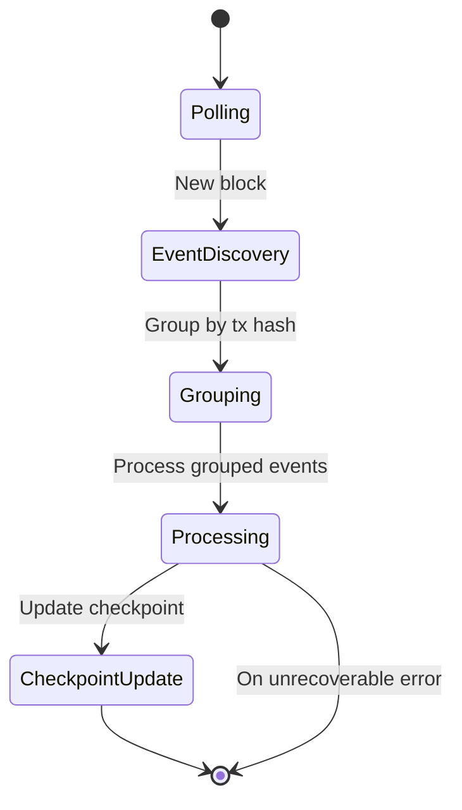
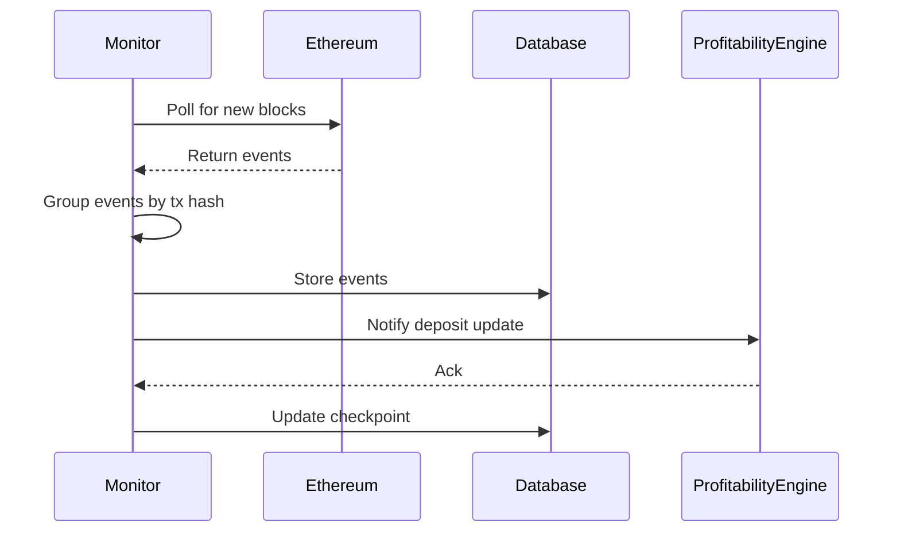

# Staker Monitor

A robust monitoring system for tracking staking events on the blockchain. This system monitors stake deposits, withdrawals, delegatee changes, and LST (Liquid Staking Token) operations in real-time while maintaining data consistency and handling network interruptions gracefully.

---

## State Diagram

---

## Sequence Diagram: Event Processing

---

## Overview

The Staker Monitor is designed to:

- Track staking events from specified smart contracts (Staker and LST)
- Process and store events in a database (Supabase or JSON)
- Handle network reorgs and connection issues
- Group related events by transaction for atomic processing
- Provide real-time monitoring status and health checks
- Support graceful shutdowns and error recovery

## Architecture

### Core Components

1. **StakerMonitor**: The main orchestrator that:
   - Manages the event processing lifecycle
   - Handles blockchain polling and event filtering
   - Maintains processing checkpoints
   - Groups related events by transaction
   - Provides monitoring status and health checks

2. **EventProcessor**: Processes multiple types of blockchain events:
   - StakeDeposited
   - StakeWithdrawn
   - DelegateeAltered
   - StakedWithAttribution
   - Unstaked
   - DepositInitialized
   - DepositUpdated

3. **Database Interface**: Supports multiple database backends:
   - Supabase (default)
   - JSON file storage

---

## Key Features

- **Transaction Grouping**: Groups related events by transaction hash for atomic processing
- **Checkpoint System**: Tracks last processed block to resume after interruptions
- **Retry Logic**: Implements exponential backoff for failed event processing
- **Health Monitoring**: Regular status checks and lag reporting
- **Graceful Shutdown**: Proper cleanup on process termination
- **LST Integration**: Support for Liquid Staking Token operations
- **Atomic Processing**: Ensures related events are processed together
- **Configurable Confirmations**: Waits for specified block confirmations before processing

---

## Configuration

Configuration is managed through environment variables (see root README for details).

---

## Error Handling

- Automatic retries with exponential backoff
- Transaction-level atomicity
- Graceful shutdown on SIGTERM/SIGINT
- Uncaught exception handling
- Network disconnection recovery
- Database operation retries

---

## Monitoring and Maintenance

- Real-time status: processing lag, last processed block, network status
- Health checks: network, lag, database, contract, event status
- Use `getMonitorStatus()` for programmatic health
