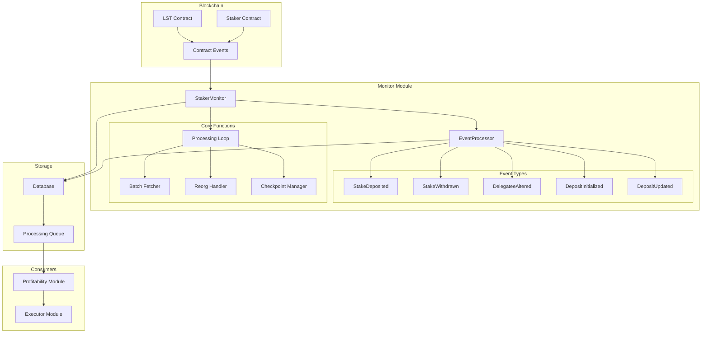
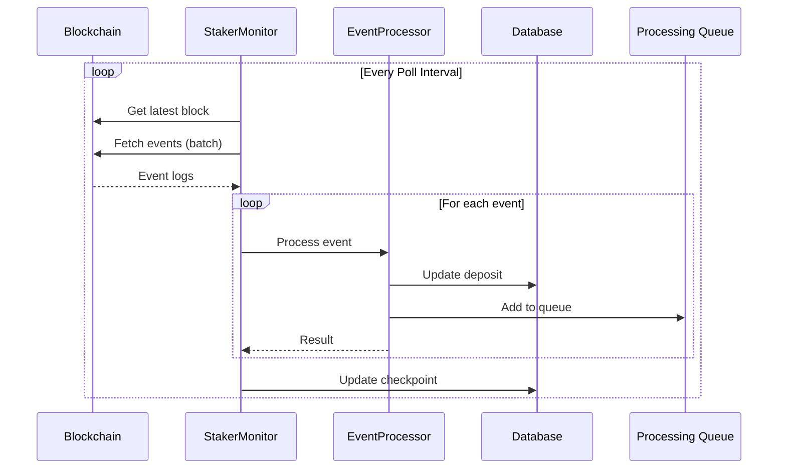
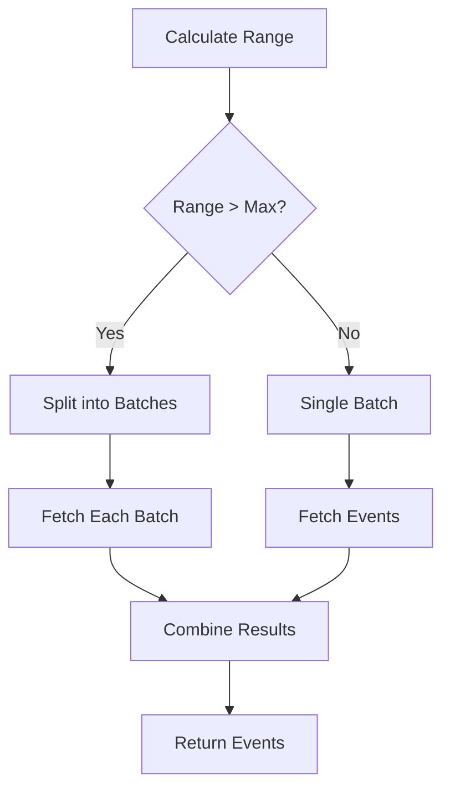
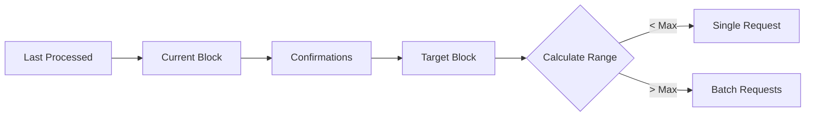
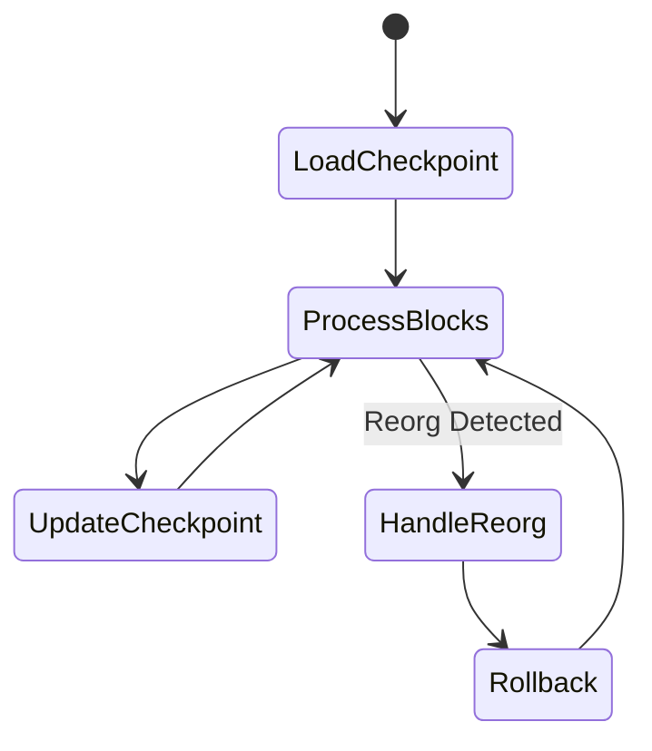
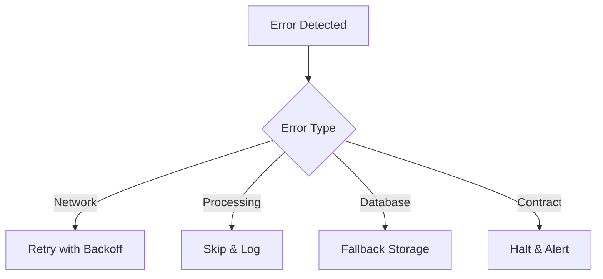
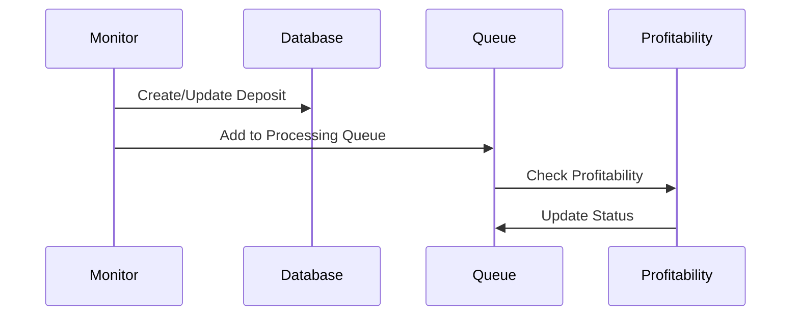

# Monitor Module

## Overview

The Monitor module continuously watches blockchain events related to staking operations. It processes deposit creation, updates, withdrawals, and delegation changes, maintaining an up-to-date view of all staking positions in the database.

## Architecture



## Event Processing Flow



## Components

### 1. StakerMonitor

**Purpose**: Main orchestrator for blockchain event monitoring.

**Key Responsibilities**:

- Maintains connection to blockchain
- Fetches events in batches
- Handles chain reorganizations
- Manages processing checkpoints
- Emits events for other modules

**Core Methods**:

#### `processLoop()`

Continuous loop that:

1. Calculates block range to process
2. Fetches events from contracts
3. Groups events by transaction
4. Processes events in order
5. Updates checkpoint
6. Handles errors and retries

#### `fetchEventsInBatches()`



### 2. EventProcessor

**Purpose**: Processes individual blockchain events and updates database state.

**Event Handlers**:

#### `processStakeDeposited()`

- Creates new deposit or updates existing
- Tracks owner, depositor, delegatee
- Accumulates deposit amounts

#### `processStakeWithdrawn()`

- Reduces deposit amount
- Removes deposit if fully withdrawn
- Maintains withdrawal history

#### `processDelegateeAltered()`

- Updates deposit delegatee
- Tracks delegation changes
- Validates deposit exists

#### `processDepositUpdated()`

- Updates earning power
- Tracks reward eligibility
- Syncs with contract state

### 3. Event Types

```typescript
interface StakeDepositedEvent {
  depositId: string;
  ownerAddress: string;
  depositorAddress: string;
  delegateeAddress: string;
  amount: bigint;
  blockNumber: number;
  transactionHash: string;
}

interface DelegateeAlteredEvent {
  depositId: string;
  oldDelegatee: string;
  newDelegatee: string;
  blockNumber: number;
  transactionHash: string;
}
```

## Processing Strategy

### 1. Block Range Management



**Configuration**:

- `maxBlockRange`: 2000 blocks per request
- `confirmations`: 20 blocks for finality
- `reorgDepth`: 64 blocks safety buffer

### 2. Transaction Grouping

Events are grouped by transaction for atomic processing:

```typescript
Map<txHash, Event[]>; // Groups events by transaction
```

This ensures related events (e.g., deposit + delegation) are processed together.

### 3. Checkpoint Management



Checkpoints track:

- `last_block_number`: Last successfully processed block
- `block_hash`: Hash for reorg detection
- `last_update`: Timestamp of last update

### 4. Reorg Handling

When a reorganization is detected:

1. Roll back to safe block (current - reorgDepth)
2. Re-process affected blocks
3. Update checkpoint with new chain state

## Error Handling

### Retry Logic

```typescript
// Exponential backoff with jitter
delay = baseDelay * Math.pow(2, attempt) + jitter;
maxRetries = 5;
```

### Error Categories

1. **Network Errors**: Temporary RPC failures
2. **Processing Errors**: Invalid event data
3. **Database Errors**: Storage failures
4. **Contract Errors**: Invalid contract state

### Recovery Strategies



## Performance Optimization

### 1. Batch Processing

- Fetch multiple blocks in single request
- Process events in transaction groups
- Bulk database operations

### 2. Caching

- Contract interfaces cached
- Recent blocks kept in memory
- Checkpoint updates batched

### 3. Parallel Processing

- Multiple contract queries in parallel
- Independent events processed concurrently
- Database writes queued

## Integration with Other Modules

### Processing Queue Flow



### Event Emission

The monitor emits events for:

- New deposits discovered
- Deposit amounts changed
- Delegations altered
- Processing errors

## Configuration

### Key Parameters

```typescript
{
  pollInterval: 15,        // Seconds between polls
  maxBlockRange: 2000,     // Max blocks per request
  confirmations: 20,       // Blocks before finality
  reorgDepth: 64,         // Reorg safety buffer
  startBlock: 0,          // Initial block to process
}
```

### Health Monitoring

- Tracks last successful poll
- Monitors error rates
- Checks block lag
- Validates database connectivity

## Best Practices

1. **Start from Recent Block**: Don't scan entire history unnecessarily
2. **Use Appropriate Confirmations**: Balance safety vs latency
3. **Monitor Health Metrics**: Track processing lag and errors
4. **Handle Reorgs Gracefully**: Always check block hashes
5. **Batch Operations**: Minimize RPC and database calls

## Common Issues and Solutions

### Issue: Processing Lag

**Solution**: Increase batch size or reduce poll interval

### Issue: RPC Rate Limits

**Solution**: Implement request throttling and caching

### Issue: Memory Growth

**Solution**: Limit in-memory event buffer size

### Issue: Missed Events

**Solution**: Use deposit discovery scan periodically

## Metrics

- **Blocks Processed**: Total blocks scanned
- **Events Processed**: Count by type
- **Processing Latency**: Time behind chain tip
- **Error Rate**: Failures per time period
- **Queue Depth**: Pending items for processing

This module ensures complete and accurate tracking of all staking positions, forming the foundation for profitability analysis and reward claiming.
