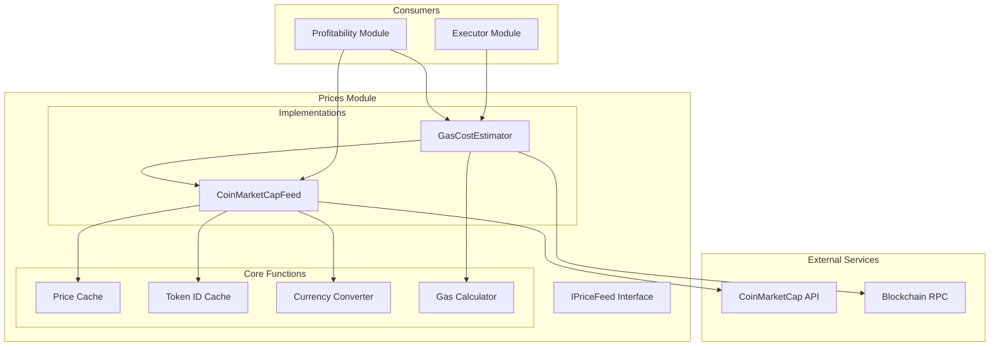
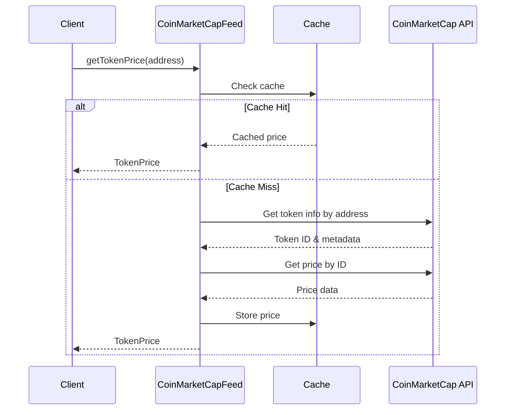
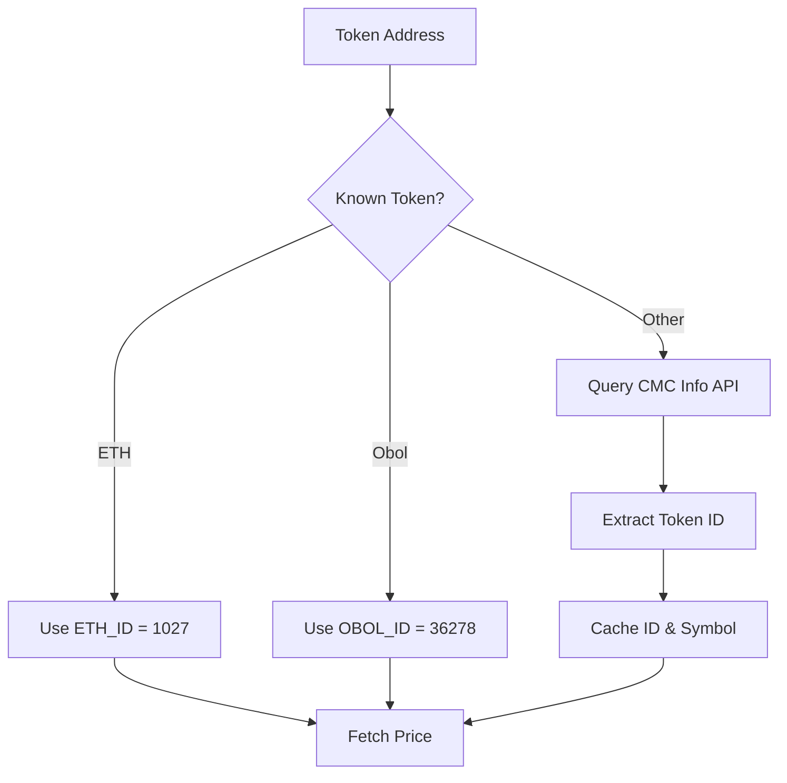
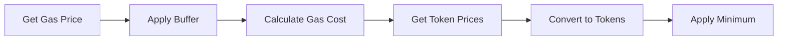
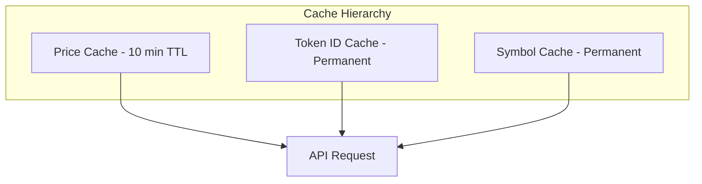
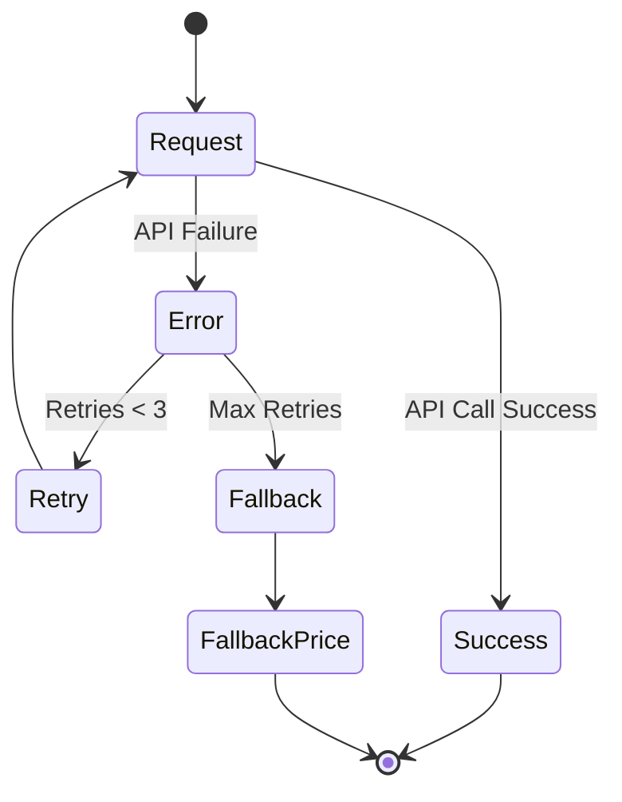

# Prices Module

## Overview

The Prices module provides real-time price feeds and gas cost estimation capabilities. It interfaces with external price oracles (CoinMarketCap) to convert between ETH gas costs and reward token values, enabling accurate profitability calculations.

## Architecture



## Components

### 1. IPriceFeed Interface

**Purpose**: Defines the contract for price feed implementations.

**Methods**:

```typescript
interface IPriceFeed {
  getTokenPrice(tokenAddress: string): Promise<TokenPrice>;
  getTokenPriceInWei(
    tokenAddress: string,
    amount: BigNumberish,
  ): Promise<bigint>;
}

interface TokenPrice {
  usd: number;
  lastUpdated: Date;
}
```

### 2. CoinMarketCapFeed

**Purpose**: Fetches real-time token prices from CoinMarketCap API.

**Key Features**:

- Token address to CMC ID resolution
- Price caching with TTL
- Special handling for ETH and known tokens
- Concurrent price fetching
- Error handling with retries

**Price Fetching Flow**:



**Token ID Resolution**:



### 3. GasCostEstimator

**Purpose**: Estimates gas costs and converts them to reward token amounts.

**Key Features**:

- Real-time gas price fetching
- EIP-1559 support with fallbacks
- Price conversion with decimal handling
- Minimum cost enforcement
- Caching for performance

**Gas Estimation Process**:



**Conversion Formula**:

```typescript
// Gas cost in ETH
gasCostETH = gasPrice * gasUnits;

// Convert to USD
gasCostUSD = gasCostETH * ethPriceUSD;

// Convert to reward tokens
gasCostTokens = gasCostUSD / tokenPriceUSD;

// With decimal adjustment
gasCostTokens =
  (gasCostETH * ethPriceScaled) / (tokenPriceScaled * decimalAdjustment);
```

## Price Caching Strategy

### Cache Layers



### Cache Management

- **Price Cache**: 10-minute TTL for price data
- **ID Cache**: Permanent cache for address→CMC_ID mapping
- **Symbol Cache**: Permanent cache for address→symbol mapping

## Error Handling

### Retry Strategy



### Fallback Values

```typescript
FALLBACK_ETH_PRICE_USD = 2500; // Conservative ETH price
FALLBACK_TOKEN_PRICE_USD = 0.1; // Conservative token price
MINIMUM_GAS_COST_USD = 30; // Minimum transaction cost
FALLBACK_GAS_PRICE_GWEI = 3; // Safe gas price
```

## Configuration

### Environment Variables

```typescript
{
  COINMARKETCAP_API_KEY: string,        // CMC API key
  REWARD_TOKEN_ADDRESS: string,         // Token contract address
  GOVLST_REWARD_TOKEN_DECIMALS: number, // Token decimals
}
```

### Price Feed Config

```typescript
{
  apiKey: string,
  baseUrl: 'https://pro-api.coinmarketcap.com',
  timeout: 5000,
  retries: 3,
  rewardToken: string,
  gasToken: 'ETH'
}
```

## Usage Examples

### Get Token Price

```typescript
const feed = new CoinMarketCapFeed(config, logger);
const price = await feed.getTokenPrice('0x...');
console.log(`Price: $${price.usd}`);
```

### Estimate Gas Cost

```typescript
const estimator = new GasCostEstimator();
const gasUnits = 300000n;
const gasPrice = await provider.getFeeData();
const costInTokens = await estimator.estimateGasCostInRewardTokens(
  gasUnits,
  gasPrice.gasPrice,
);
```

### Convert ETH to Tokens

```typescript
const prices = await feed.getTokenPrices();
const ethAmount = ethers.parseEther('0.01'); // 0.01 ETH
const tokenAmount = (ethAmount * ethPriceScaled) / tokenPriceScaled;
```

## Performance Optimizations

### 1. Caching Strategy

- **Multi-layer caching**: Price, ID, and symbol caches
- **TTL management**: Automatic cache expiration
- **Batch requests**: Parallel price fetching

### 2. Request Optimization

- **Connection pooling**: Reuse HTTP connections
- **Timeout handling**: Prevent hanging requests
- **Rate limiting**: Respect API limits

### 3. Fallback Mechanisms

- **Graceful degradation**: Use cached/fallback values
- **Error recovery**: Automatic retry with backoff
- **Minimum enforcement**: Prevent unrealistic values

## Integration Points

### With Profitability Module

```typescript
// Gas cost conversion
const gasCostInTokens = await estimator.convertGasUnitsToRewardToken(gasUnits);

// Price ratio for calculations
const { rewardToken, gasToken } = await feed.getTokenPrices();
const priceRatio = gasToken.usd / rewardToken.usd;
```

### With Executor Module

```typescript
// Gas price estimation
const gasPrice = await estimator.getCurrentGasPrice(provider);

// Cost validation
const minCostUSD = 30;
if (estimatedCostUSD < minCostUSD) {
  // Skip transaction
}
```

## Error Types

1. **Network Errors**: API timeout, connection failures
2. **API Errors**: Invalid API key, rate limits, invalid requests
3. **Data Errors**: Missing token data, invalid responses
4. **Conversion Errors**: Price calculation failures

## Best Practices

1. **Use Caching**: Always check cache before API calls
2. **Handle Failures**: Implement robust fallback strategies
3. **Monitor Limits**: Track API usage and rate limits
4. **Validate Data**: Ensure prices are reasonable
5. **Update Regularly**: Keep cache fresh for accuracy

## Common Issues and Solutions

### Issue: Token Not Found

**Solution**: Verify contract address and add manual ID mapping

### Issue: Stale Prices

**Solution**: Reduce cache TTL or implement push notifications

### Issue: API Rate Limits

**Solution**: Implement exponential backoff and request batching

### Issue: Price Volatility

**Solution**: Use price buffers and frequent updates

## Monitoring

### Key Metrics

- **Cache Hit Rate**: Percentage of requests served from cache
- **API Response Time**: Average latency for price requests
- **Error Rate**: Failed requests per time period
- **Price Variance**: Deviation from expected ranges

### Health Checks

- API connectivity validation
- Price data freshness verification
- Cache consistency checks
- Fallback value testing

This module ensures accurate and reliable price data for profitable transaction execution while handling the inherent volatility and unreliability of external price feeds.
