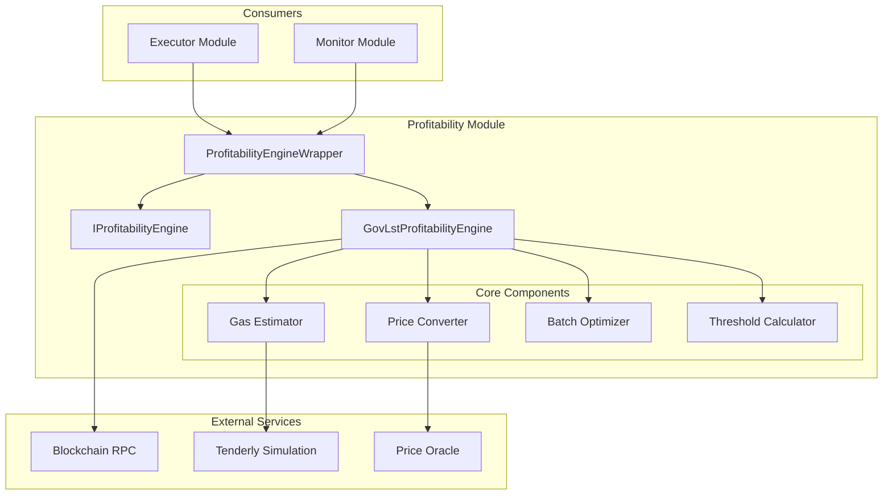
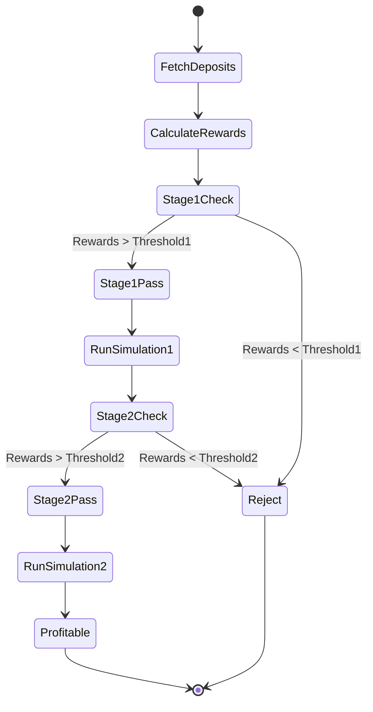
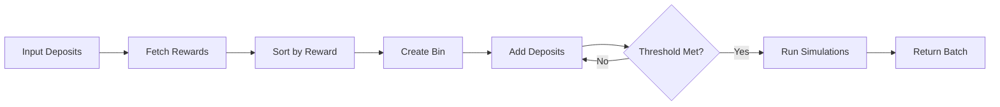
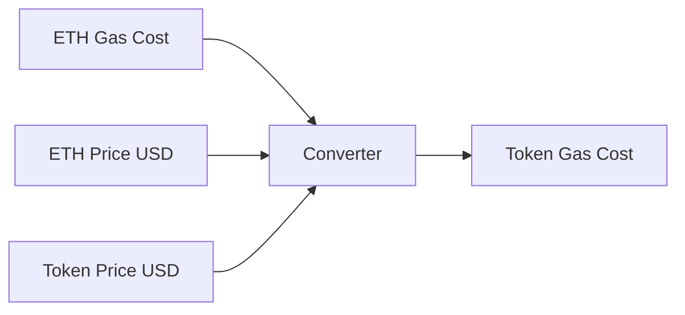
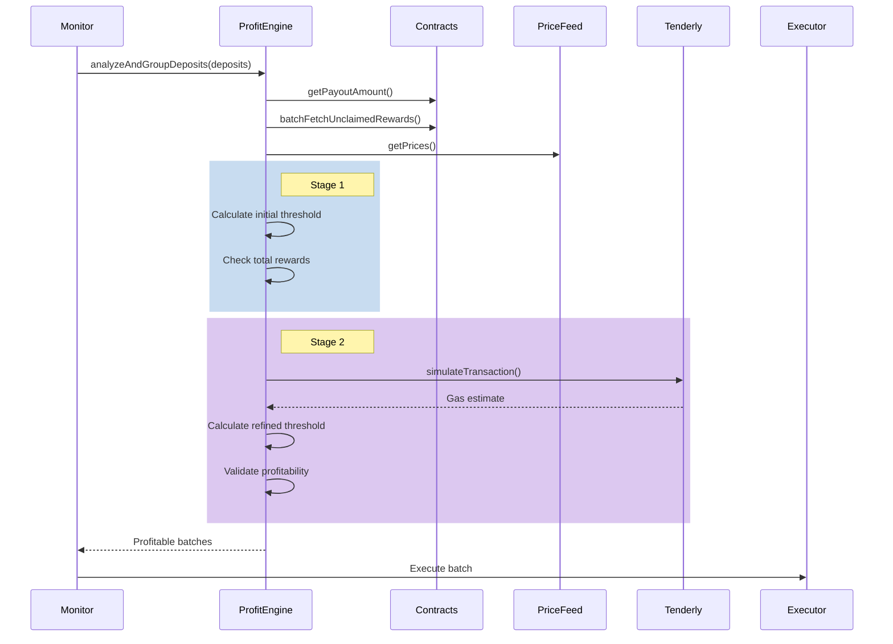

# Profitability Module

## Overview

The Profitability module determines whether claiming rewards for staking deposits is economically viable. It implements a sophisticated two-stage gas simulation approach to ensure accurate profitability calculations, preventing unprofitable transactions while maximizing rewards.

## Architecture



## Core Algorithm

### Two-Stage Profitability Check



### Stage Details

**Stage 1: Initial Check**

- Uses fallback gas estimates
- Calculates: `threshold1 = payoutAmount + initialGasCost + margin`
- Quick rejection of clearly unprofitable deposits

**Stage 2: Refined Check**

- Uses actual simulated gas costs
- Calculates: `threshold2 = payoutAmount + simulatedGasCost + (payoutAmount * scaledMargin)`
- Final validation before execution

## Components

### 1. ProfitabilityEngineWrapper

**Purpose**: Factory and lifecycle manager for profitability engines.

**Responsibilities**:

- Creates appropriate engine instances
- Manages engine lifecycle
- Provides consistent interface

### 2. GovLstProfitabilityEngine

**Purpose**: Core profitability calculation engine for GovLst protocol.

**Key Methods**:

#### `analyzeAndGroupDeposits(deposits: GovLstDeposit[])`



#### `checkGroupProfitability(deposits: GovLstDeposit[])`

- Validates earning power requirements
- Calculates total unclaimed rewards
- Estimates gas costs in reward tokens
- Determines profitability constraints

### 3. Price Conversion

**Flow**:



**Formula**:

```
tokenCost = (ethGasCost * ethPriceUSD) / tokenPriceUSD
```

### 4. Gas Estimation

**Sources**:

1. **Fallback Estimate**: 300,000 gas units
2. **Tenderly Simulation**: Accurate gas prediction
3. **Dynamic Calculation**: Base + (perDeposit \* count)

**Buffer Application**:

- Simulation result + 30% buffer
- Minimum 300,000 gas units
- Maximum 10,000,000 gas units

## Data Flow



## Threshold Calculations

### Base Threshold Components

1. **Payout Amount**: Fixed protocol requirement
2. **Gas Cost**: Dynamic based on network conditions
3. **Profit Margin**: Scaled by deposit count

### Profit Margin Scaling

```typescript
scaledMargin = baseMargin + (depositCount * 0.02%)
// Capped at 5% maximum
```

This ensures larger batches have higher profit requirements to compensate for increased risk.

### Minimum Expected Reward

```
minExpectedReward = payoutAmount + gasCost + (payoutAmount * scaledMargin)
```

## Configuration

### Environment Variables

- `PROFITABILITY_MIN_PROFIT_MARGIN_PERCENT`: Base profit margin
- `PROFITABILITY_INCLUDE_GAS_COST`: Include gas in calculations
- `GOVLST_PAYOUT_AMOUNT`: Fixed payout requirement
- `GOVLST_MIN_EARNING_POWER`: Minimum deposit eligibility

### Constants

```typescript
GAS_CONSTANTS = {
  FALLBACK_GAS_ESTIMATE: 300_000n,
  GAS_PRICE_UPDATE_INTERVAL: 60_000,
  MIN_GAS_PRICE: 1_000_000_000n, // 1 gwei
};
```

## Error Handling

### Retry Logic

- Contract calls: 3 retries with exponential backoff
- Price feeds: Cached results with fallback
- Simulations: Graceful degradation to estimates

### Error Types

- `GasEstimationError`: Simulation failures
- `BatchFetchError`: Reward fetching issues
- `QueueProcessingError`: Processing pipeline errors

## Optimization Strategies

### 1. Batch Accumulation

Deposits are accumulated until reaching optimal size:

- Maximizes gas efficiency
- Ensures sufficient profit margin
- Allows multiple profitable claims

### 2. Reward Sorting

Deposits sorted by reward size:

- Prioritizes highest value deposits
- Reaches threshold faster
- Minimizes transaction count

### 3. Early Termination

Stops adding deposits when threshold met:

- Prevents oversized transactions
- Maintains profitability ratio
- Enables remaining deposits for future batches

## Best Practices

1. **Monitor Price Feeds**: Ensure accurate ETH/token prices
2. **Adjust Margins**: Set appropriate profit margins for market conditions
3. **Gas Buffer**: Account for gas price volatility
4. **Simulation Limits**: Respect rate limits on Tenderly
5. **Batch Sizes**: Balance between efficiency and gas limits

## Common Issues and Solutions

### Issue: "Insufficient rewards after accurate gas estimation"

**Cause**: Gas costs exceed profit margin after simulation
**Solution**: Accumulate more deposits or wait for better gas prices

### Issue: High gas costs for small token values

**Cause**: Low token price relative to ETH
**Solution**: Increase minimum batch sizes or profit margins

### Issue: Simulation failures

**Cause**: Network issues or invalid transactions
**Solution**: Fallback to conservative estimates

## Performance Metrics

- **Batch Formation Time**: < 5 seconds
- **Simulation Latency**: ~1-2 seconds per simulation
- **Price Cache Duration**: 10 minutes
- **Gas Price Updates**: Every 60 seconds

This module ensures that every reward claim is profitable, protecting users from losing money on gas costs while maximizing their staking rewards.
