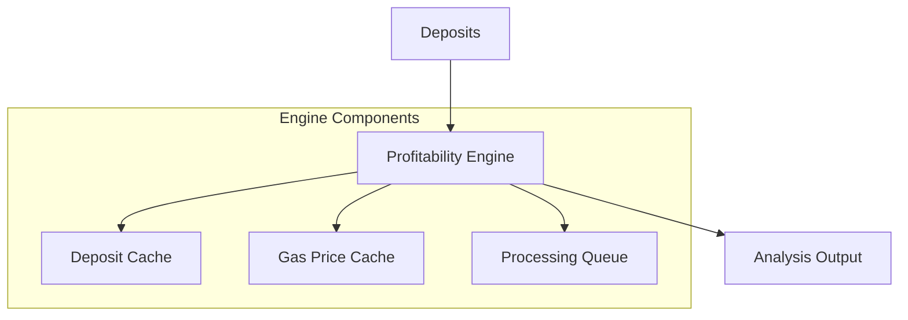

# GovLst Profitability Engine

The Profitability Engine analyzes GovLst deposits to determine optimal grouping and profitability metrics for reward claiming. It provides detailed analysis of deposit groups, considering gas costs, reward rates, and market conditions.

## Core Functionality

The engine performs two primary functions:

1. Analyzing individual deposit groups for profitability
2. Optimizing deposit batches for maximum profit

## System Architecture



### Key Components

#### ProfitabilityEngineWrapper

- Main orchestrator for profitability analysis
- Manages deposit caching and queue processing
- Handles batch optimization and analysis

#### GovLstProfitabilityEngine

- Core profitability calculation logic
- Gas cost estimation
- Share and reward calculations
- Batch optimization algorithms

## Inputs

### 1. Configuration (ProfitabilityConfig)

```typescript
{
  rewardTokenAddress: string,     // Reward token contract address
  minProfitMargin: bigint,       // Minimum acceptable profit
  gasPriceBuffer: number,        // Gas price safety buffer (%)
  maxBatchSize: number,          // Maximum deposits per batch
  defaultTipReceiver: string,    // Default tip receiver address
  priceFeed: {
    cacheDuration: number        // Price cache duration (ms)
  }
}
```

### 2. Deposit Data (GovLstDeposit)

```typescript
{
  deposit_id: bigint,            // Unique deposit identifier
  owner_address: string,         // Deposit owner address
  delegatee_address: string | null, // Optional delegatee
  amount: bigint,               // Deposit amount
  shares_of: bigint,            // Current share allocation
  payout_amount: bigint         // Expected payout amount
}
```

### 3. External Dependencies

- Ethereum Provider (RPC connection)
- GovLst Contract Instance
- Price Feed Service
- Database Connection
- Logging Service

## Outputs

### 1. Profitability Analysis (GovLstProfitabilityCheck)

```typescript
{
  is_profitable: boolean,        // Overall profitability flag
  constraints: {
    has_enough_shares: boolean,  // Share threshold check
    meets_min_reward: boolean,   // Minimum reward check
    is_profitable: boolean       // Profit after gas check
  },
  estimates: {
    total_shares: bigint,       // Group's total shares
    payout_amount: bigint,      // Expected payout
    gas_estimate: bigint,       // Estimated gas cost
    expected_profit: bigint     // Net profit after gas
  }
}
```

### 2. Batch Analysis (GovLstBatchAnalysis)

```typescript
{
  deposit_groups: [             // Array of profitable groups
    {
      deposit_ids: bigint[],    // Group member IDs
      total_shares: bigint,     // Group's total shares
      total_payout: bigint,     // Group's total payout
      expected_profit: bigint,  // Group's net profit
      gas_estimate: bigint      // Group's gas cost
    }
  ],
  total_gas_estimate: bigint,   // Total gas for all groups
  total_expected_profit: bigint,// Total net profit
  total_deposits: number        // Total deposits analyzed
}
```

### 3. Engine Status

```typescript
{
  isRunning: boolean,           // Engine state
  lastGasPrice: bigint,        // Latest gas price
  lastUpdateTimestamp: number,  // Last update time
  queueSize: number,           // Current queue size
  groupCount: number           // Active group count
}
```

## Performance Optimizations

### 1. Caching System

- **Deposit Cache**

  - TTL: 5 minutes
  - Reduces database load
  - Quick access to frequent deposits

- **Gas Price Cache**
  - Updates every minute
  - Includes price buffer
  - Reduces RPC calls

### 2. Batch Processing

- Groups deposits by profitability
- Optimizes gas usage
- Maintains processing queue
- Handles requeuing on restarts

## Error Handling

### Error Types

```typescript
-ProfitabilityError - // Base error class
  DepositNotFoundError - // Missing deposit
  InvalidDepositDataError - // Malformed data
  GasEstimationError - // Gas calculation issues
  QueueProcessingError; // Queue operation failures
```

### Error Recovery

- Automatic retry mechanism
- Configurable retry limits
- Error context preservation
- Detailed error logging

## Usage Examples

### Initialize Engine

```typescript
const engine = new GovLstProfitabilityEngineWrapper(
  database,
  govLstContract,
  provider,
  logger,
  priceFeed,
  {
    rewardTokenAddress: '0x...',
    minProfitMargin: BigInt(1e16),
    gasPriceBuffer: 20,
    maxBatchSize: 50,
    defaultTipReceiver: '0x...',
    priceFeed: {
      cacheDuration: 300_000,
    },
  },
);
```

### Check Group Profitability

```typescript
const profitability = await engine.checkGroupProfitability(deposits);
if (profitability.is_profitable) {
  console.log(`Expected profit: ${profitability.estimates.expected_profit}`);
}
```

### Analyze Deposits

```typescript
const analysis = await engine.analyzeAndGroupDeposits(deposits);
console.log(`Found ${analysis.deposit_groups.length} profitable groups`);
console.log(`Total profit: ${analysis.total_expected_profit}`);
```

## Monitoring

### Health Metrics

- Engine running state
- Queue processing rate
- Cache hit rates
- Gas price trends
- Profitability statistics

### Performance Metrics

- Processing latency
- Queue backlog size
- Cache efficiency
- Error rates
- Profit margins

## Database Schema

### Processing Queue

```sql
CREATE TABLE processing_queue (
  deposit_id TEXT PRIMARY KEY,
  status TEXT NOT NULL,
  attempts INTEGER DEFAULT 0,
  last_attempt TIMESTAMP,
  error TEXT,
  created_at TIMESTAMP DEFAULT NOW()
);
```

### Profitability Results

```sql
CREATE TABLE profitability_results (
  group_id TEXT PRIMARY KEY,
  deposit_ids TEXT[],
  total_shares NUMERIC,
  expected_profit NUMERIC,
  gas_estimate NUMERIC,
  analyzed_at TIMESTAMP DEFAULT NOW()
);
```

## Testing

### Unit Tests

- Profitability calculations
- Gas estimation
- Batch optimization
- Error handling
- Cache management

### Integration Tests

- Database operations
- Contract interactions
- Price feed integration
- Queue processing
- End-to-end flows

## Future Improvements

1. Dynamic batch size optimization
2. Machine learning for gas prediction
3. Advanced profit optimization strategies
4. Real-time market condition adaptation
5. Enhanced monitoring and alerting
