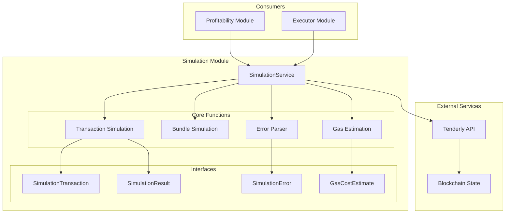
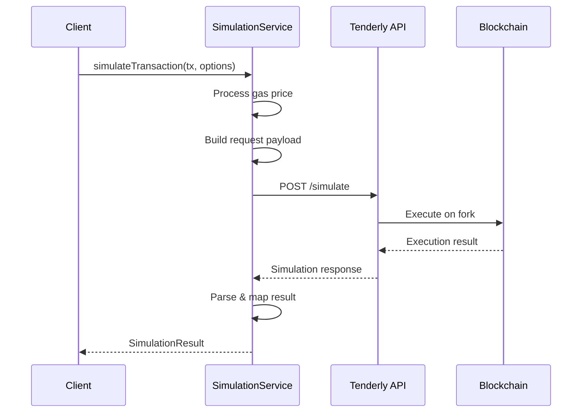
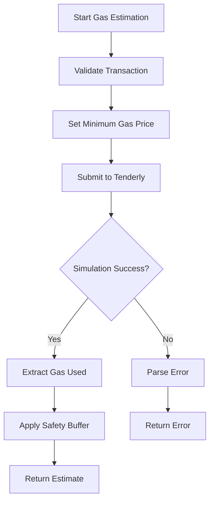
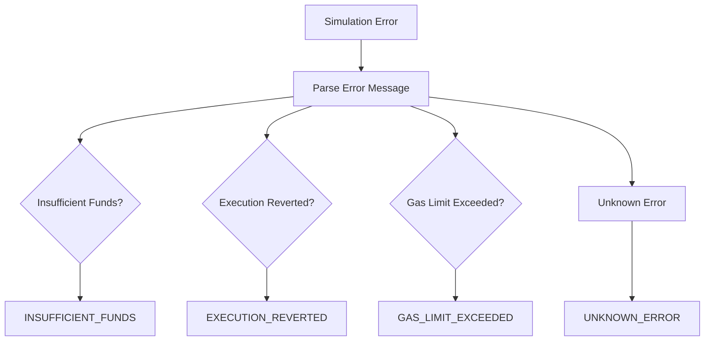

# Simulation Module

## Overview

The Simulation module provides transaction simulation capabilities using Tenderly's infrastructure. It enables pre-execution validation, accurate gas estimation, and error detection before committing transactions to the blockchain, significantly reducing failed transactions and improving cost efficiency.

## Architecture



## Core Components

### 1. SimulationService

**Purpose**: Main interface for transaction simulation using Tenderly API.

**Key Methods**:

#### `simulateTransaction(transaction, options)`
Simulates a single transaction with full trace and logs:
```typescript
const result = await simulationService.simulateTransaction({
  from: '0x...',
  to: '0x...',
  data: '0x...',
  gas: 300000,
  gasPrice: '20000000000'
}, {
  networkId: '1',
  save: false
});
```

#### `simulateBundle(transactions, options)`
Simulates multiple transactions as a bundle:
```typescript
const results = await simulationService.simulateBundle([
  transaction1,
  transaction2
], options);
```

#### `estimateGasCosts(transaction, options)`
Fast gas estimation without full simulation:
```typescript
const estimate = await simulationService.estimateGasCosts(transaction, options);
// Returns: { gasUnits, gasPrice, gasPriceDetails, timestamp }
```

### 2. Data Structures

#### SimulationTransaction
```typescript
interface SimulationTransaction {
  from: string              // Sender address
  to: string               // Contract address
  data?: string            // Encoded function call
  value?: string | number  // ETH value to send
  gas: number             // Gas limit
  gasPrice?: string       // Gas price in wei
  maxFeePerGas?: number   // EIP-1559 max fee
  maxPriorityFeePerGas?: number // EIP-1559 priority fee
}
```

#### SimulationResult
```typescript
interface SimulationResult {
  success: boolean
  gasUsed: number
  error?: SimulationError
  trace?: TransactionTrace
  logs?: Array<EventLog>
  returnValue?: string
  status?: boolean
}
```

#### SimulationError
```typescript
interface SimulationError {
  code: 'INSUFFICIENT_FUNDS' | 'EXECUTION_REVERTED' | 
        'GAS_LIMIT_EXCEEDED' | 'SIMULATION_FAILED' | 'UNKNOWN_ERROR'
  message: string
  details?: string
}
```

## Simulation Flow

### Single Transaction Simulation



### Gas Estimation Flow



## Gas Price Handling

### Minimum Gas Price Protection

```typescript
const MIN_SIMULATION_GAS_PRICE_GWEI = 1  // 1 gwei minimum
const DEFAULT_SIMULATION_GAS_PRICE_GWEI = 20  // 20 gwei default

// Process gas price
if (!gasPrice || gasPrice === '0') {
  gasPrice = ethers.parseUnits('20', 'gwei').toString()
} else if (gasPriceWei < minGasPriceWei) {
  gasPrice = minGasPriceWei.toString()
}
```

**Purpose**: Prevents Tenderly simulation failures from unrealistic gas prices.

### EIP-1559 Support

The service supports both legacy and EIP-1559 transactions:
- Legacy: Uses `gasPrice`
- EIP-1559: Uses `maxFeePerGas` and `maxPriorityFeePerGas`

## Error Handling

### Error Classification



### Error Recovery

```typescript
try {
  return await simulateTransaction(tx, options)
} catch (error) {
  const simulationError = parseSimulationError(error)
  return {
    success: false,
    gasUsed: 0,
    error: simulationError
  }
}
```

## Configuration

### Environment Variables
```typescript
{
  TENDERLY_ACCESS_KEY: string,     // 32-char API key
  TENDERLY_ACCOUNT_NAME: string,   // Account slug
  TENDERLY_PROJECT_NAME: string,   // Project slug
  TENDERLY_NETWORK_ID: string,     // Network ID (default: '1')
  TENDERLY_USE_SIMULATE: boolean   // Enable simulation
}
```

### API Endpoints
- **Single Transaction**: `/api/v1/account/{account}/project/{project}/simulate`
- **Bundle**: `/api/v1/account/{account}/project/{project}/simulate-bundle`
- **Gas Estimation**: Same endpoint with `estimate_gas: true`

## State Overrides

Simulation supports state modifications for testing scenarios:

```typescript
const options = {
  overrides: {
    '0x...': {
      balance: '1000000000000000000000', // 1000 ETH
      nonce: 0,
      code: '0x...',  // Custom contract code
      state: {
        '0x0': '0x1'   // Storage slot overrides
      }
    }
  }
}
```

## Performance Optimization

### 1. Simulation Types

```typescript
// Quick estimation (faster)
simulation_type: 'quick'
estimate_gas: true

// Full simulation (detailed)
simulation_type: 'full'
generate_access_list: true
```

### 2. Caching Strategy

- Gas estimates cached for similar transactions
- Network state cached during batch operations
- Price data reused across simulations

### 3. Request Optimization

- Bundle multiple transactions when possible
- Use appropriate simulation type for use case
- Minimize state overrides for performance

## Integration with Other Modules

### Profitability Module Integration

```typescript
// Pre-execution validation
const simulation = await simulationService.simulateTransaction(tx, options)
if (!simulation.success) {
  throw new Error(`Transaction would fail: ${simulation.error?.message}`)
}

// Accurate gas estimation
const gasEstimate = await simulationService.estimateGasCosts(tx, options)
const gasCostInTokens = await convertGasToTokens(gasEstimate.gasUnits)
```

### Executor Module Integration

```typescript
// Validate before submission
const validation = await simulateTransaction(queuedTx, options)
if (!validation.success) {
  markTransactionFailed(queuedTx.id, validation.error)
  return
}

// Optimize gas parameters
const estimate = await estimateGasCosts(queuedTx, options)
queuedTx.gasLimit = estimate.gasUnits * 1.2 // 20% buffer
```

## Best Practices

1. **Always Validate**: Simulate before submitting expensive transactions
2. **Use Appropriate Type**: Quick for gas estimation, full for debugging
3. **Handle Errors**: Gracefully handle simulation failures
4. **Set Realistic Limits**: Use appropriate gas limits and prices
5. **Cache Results**: Reuse simulation results when possible

## Common Issues and Solutions

### Issue: "Insufficient Funds" Errors
**Solution**: Use state overrides to provide sufficient balance

### Issue: Very Low Gas Price Failures
**Solution**: Enforce minimum 1 gwei gas price for simulations

### Issue: Contract Not Found
**Solution**: Verify contract address and network ID

### Issue: Rate Limiting
**Solution**: Implement request throttling and exponential backoff

## Monitoring and Metrics

### Key Metrics
- **Simulation Success Rate**: Percentage of successful simulations
- **Gas Estimation Accuracy**: Actual vs simulated gas usage
- **Response Time**: API latency for simulations
- **Error Distribution**: Breakdown of error types

### Health Checks
- API connectivity validation
- Authentication verification
- Network state consistency
- Response time monitoring

## Security Considerations

1. **API Key Protection**: Store securely, rotate regularly
2. **Network Isolation**: Use appropriate network IDs
3. **State Validation**: Verify state override sources
4. **Rate Limiting**: Respect API usage limits
5. **Data Sanitization**: Validate all input parameters

This module ensures transaction reliability and cost optimization by providing comprehensive pre-execution validation and accurate gas estimation capabilities.