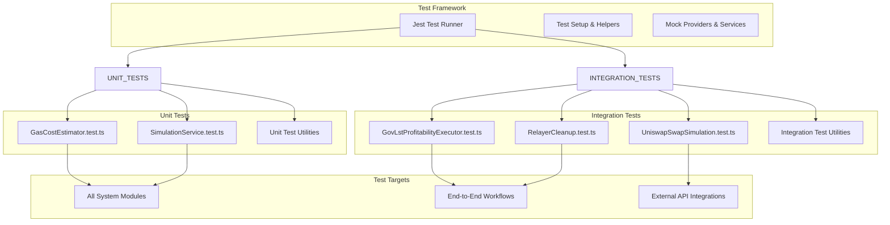
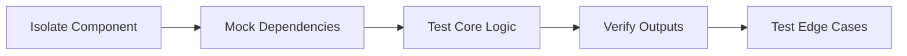
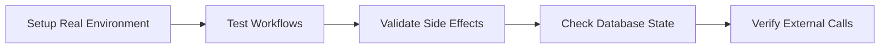
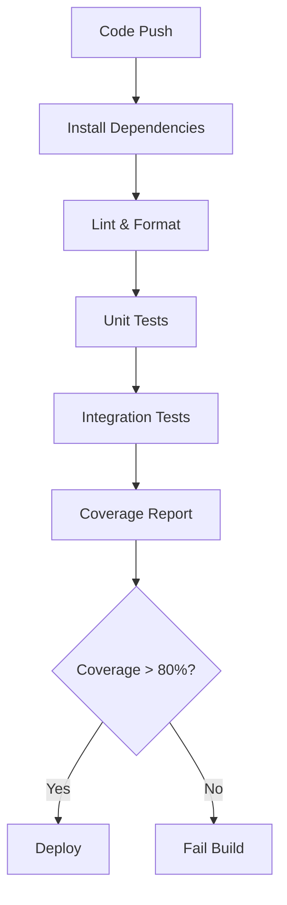

# Tests Module

## Overview

The Tests module provides comprehensive testing coverage for the staker-bots system, including unit tests for individual components and integration tests for end-to-end workflows. The test suite ensures system reliability, validates business logic, and prevents regressions.

## Architecture



## Test Categories

### 1. Unit Tests

**Purpose**: Test individual components in isolation with mocked dependencies.

#### GasCostEstimator.test.ts

- **Scope**: Price conversion and gas cost calculations
- **Key Tests**:
  - Gas cost calculation with known prices
  - Profit margin calculations
  - Fallback value handling
  - Error scenarios

```typescript
describe('GasCostEstimator', () => {
  it('should calculate total cost with gas and profit margin', async () => {
    const mockProvider = {
      getFeeData: async () => ({
        gasPrice: ethers.parseUnits('20', 'gwei'),
        maxFeePerGas: ethers.parseUnits('25', 'gwei'),
        maxPriorityFeePerGas: ethers.parseUnits('2', 'gwei'),
      }),
    };

    const estimator = new GasCostEstimator();
    const gasCostInTokens = await estimator.estimateGasCostInRewardToken(
      mockProvider,
      300000n,
    );

    expect(gasCostInTokens).toBeGreaterThan(0n);
  });
});
```

#### SimulationService.test.ts

- **Scope**: Tenderly API integration and response parsing
- **Key Tests**:
  - Transaction simulation success/failure
  - Gas estimation accuracy
  - Error handling and parsing
  - Bundle simulation

```typescript
describe('SimulationService', () => {
  it('should simulate transaction successfully', async () => {
    const service = new SimulationService();
    const result = await service.simulateTransaction({
      from: '0x...',
      to: '0x...',
      data: '0x...',
      gas: 300000,
      gasPrice: '20000000000',
    });

    expect(result.success).toBe(true);
    expect(result.gasUsed).toBeGreaterThan(0);
  });
});
```

### 2. Integration Tests

**Purpose**: Test complete workflows with real or realistic dependencies.

#### GovLstProfitabilityExecutor.test.ts

- **Scope**: End-to-end profitability analysis and execution
- **Key Tests**:
  - Complete profit analysis workflow
  - Transaction queue processing
  - Database integration
  - Error handling across modules

```typescript
describe('GovLst Profitability Executor Integration', () => {
  it('should process profitable deposits end-to-end', async () => {
    // Setup test data
    const deposits = TEST_DEPOSITS;

    // Initialize components
    const database = new DatabaseWrapper();
    const profitEngine = new GovLstProfitabilityEngineWrapper();
    const executor = new ExecutorWrapper();

    // Run profitability analysis
    const analysis = await profitEngine.analyzeAndGroupDeposits(deposits);

    // Execute profitable batches
    for (const group of analysis.deposit_groups) {
      const tx = await executor.queueTransaction(
        group.deposit_ids,
        profitabilityCheck,
      );
      expect(tx.status).toBe(TransactionStatus.QUEUED);
    }
  });
});
```

#### RelayerCleanup.test.ts

- **Scope**: OpenZeppelin Defender integration and cleanup
- **Key Tests**:
  - Relayer transaction management
  - Balance monitoring
  - Cleanup procedures
  - Error recovery

#### UniswapSwapSimulation.test.ts

- **Scope**: Token swap functionality and simulation
- **Key Tests**:
  - Swap simulation accuracy
  - Slippage calculations
  - Route optimization
  - Integration with price feeds

## Test Data Management

### Mock Data Patterns

```typescript
// Realistic test deposits
const TEST_DEPOSITS = [
  {
    deposit_id: '1',
    owner_address: '0x6Fbb31f8c459d773A8d0f67C8C055a70d943C1F1',
    amount: '19200000000000000000000',
    earning_power: '15000000000000000000000',
    rewards: '500000000000000000000',
  },
  // ... more test data
];

// Mock provider responses
const mockProvider = {
  getFeeData: () =>
    Promise.resolve({
      gasPrice: ethers.parseUnits('20', 'gwei'),
      maxFeePerGas: ethers.parseUnits('25', 'gwei'),
    }),
  getTransactionReceipt: (hash) => Promise.resolve(mockReceipt),
};

// Mock contract responses
const mockContract = {
  payoutAmount: () => Promise.resolve(ethers.parseEther('4400')),
  unclaimedReward: (id) => Promise.resolve(rewardMap.get(id)),
};
```

### Test Environment Setup

```typescript
beforeEach(async () => {
  // Initialize test database
  database = new DatabaseWrapper({ type: 'json', jsonDbPath: ':memory:' });

  // Setup mock provider
  provider = new MockProvider();

  // Initialize contracts with test ABIs
  stakerContract = new ethers.Contract(STAKER_ADDRESS, stakerAbi, provider);
  govLstContract = new ethers.Contract(GOVLST_ADDRESS, govlstAbi, provider);

  // Seed test data
  await seedTestData();
});

afterEach(async () => {
  // Cleanup test environment
  await database.clearAll();
  jest.clearAllMocks();
});
```

## Test Utilities

### Mock Factories

```typescript
export class MockProviderFactory {
  static createWithGasPrice(gasPriceGwei: number): ethers.Provider {
    return {
      getFeeData: () =>
        Promise.resolve({
          gasPrice: ethers.parseUnits(gasPriceGwei.toString(), 'gwei'),
        }),
    } as ethers.Provider;
  }
}

export class MockContractFactory {
  static createStakerContract(rewardMap: Map<string, bigint>) {
    return {
      unclaimedReward: (depositId: bigint) =>
        Promise.resolve(rewardMap.get(depositId.toString()) || 0n),
      deposits: (depositId: bigint) =>
        Promise.resolve(mockDepositData.get(depositId.toString())),
    };
  }
}
```

### Test Helpers

```typescript
export async function createTestDeposit(
  database: DatabaseWrapper,
  overrides: Partial<Deposit> = {},
): Promise<Deposit> {
  const deposit = {
    deposit_id: '12345',
    owner_address: '0x...',
    amount: '1000000000000000000000',
    created_at: new Date().toISOString(),
    updated_at: new Date().toISOString(),
    ...overrides,
  };

  await database.createDeposit(deposit);
  return deposit;
}

export function expectProfitabilityCheck(
  check: GovLstProfitabilityCheck,
  expectedProfitable: boolean,
): void {
  expect(check.is_profitable).toBe(expectedProfitable);
  expect(check.estimates.total_shares).toBeGreaterThan(0n);
  expect(check.estimates.gas_estimate).toBeGreaterThan(0n);
}
```

## Testing Strategies

### 1. Unit Testing Strategy



- **Isolation**: Test components without external dependencies
- **Mocking**: Replace external services with predictable mocks
- **Coverage**: Test both happy path and error scenarios
- **Determinism**: Ensure tests produce consistent results

### 2. Integration Testing Strategy



- **Real Dependencies**: Use actual database and network connections
- **End-to-End**: Test complete user workflows
- **State Verification**: Check persistent state changes
- **Performance**: Validate response times and throughput

### 3. Error Scenario Testing

```typescript
describe('Error Scenarios', () => {
  it('should handle network failures gracefully', async () => {
    // Mock network failure
    mockProvider.getFeeData.mockRejectedValue(new Error('Network error'));

    const result = await estimator.estimateGasCostInRewardToken(
      mockProvider,
      300000n,
    );

    // Should use fallback values
    expect(result).toBeGreaterThan(0n);
  });

  it('should handle insufficient balance', async () => {
    // Mock insufficient balance scenario
    mockContract.balanceOf.mockResolvedValue(0n);

    await expect(
      executor.validateTransaction(depositIds, profitabilityCheck),
    ).rejects.toThrow('Insufficient balance');
  });
});
```

## Continuous Integration

### Test Pipeline



### Jest Configuration

```javascript
module.exports = {
  preset: 'ts-jest',
  testEnvironment: 'node',
  roots: ['<rootDir>/src'],
  testMatch: ['**/__tests__/**/*.ts', '**/?(*.)+(spec|test).ts'],
  transform: {
    '^.+\\.ts$': 'ts-jest',
  },
  collectCoverageFrom: ['src/**/*.ts', '!src/**/*.d.ts', '!src/tests/**'],
  coverageThreshold: {
    global: {
      branches: 80,
      functions: 80,
      lines: 80,
      statements: 80,
    },
  },
  setupFilesAfterEnv: ['<rootDir>/src/tests/setup.ts'],
};
```

## Test Commands

```bash
# Run all tests
npm test

# Run specific test file
npm test -- GasCostEstimator.test.ts

# Run tests with coverage
npm run test:coverage

# Run tests in watch mode
npm run test:watch

# Run only integration tests
npm run test:integration

# Run only unit tests
npm run test:unit
```

## Best Practices

1. **Test Structure**: Follow AAA pattern (Arrange, Act, Assert)
2. **Descriptive Names**: Use clear, descriptive test names
3. **Independent Tests**: Each test should be isolated and independent
4. **Mock External Dependencies**: Mock APIs, databases, and network calls
5. **Test Edge Cases**: Include boundary conditions and error scenarios
6. **Maintain Test Data**: Keep test data realistic and up-to-date
7. **Performance Testing**: Include tests for critical performance paths

## Coverage Goals

- **Unit Tests**: >90% code coverage
- **Integration Tests**: Cover all major workflows
- **Error Handling**: Test all error conditions
- **Edge Cases**: Test boundary conditions and unusual inputs

This comprehensive test suite ensures system reliability and provides confidence for production deployments and ongoing development.
